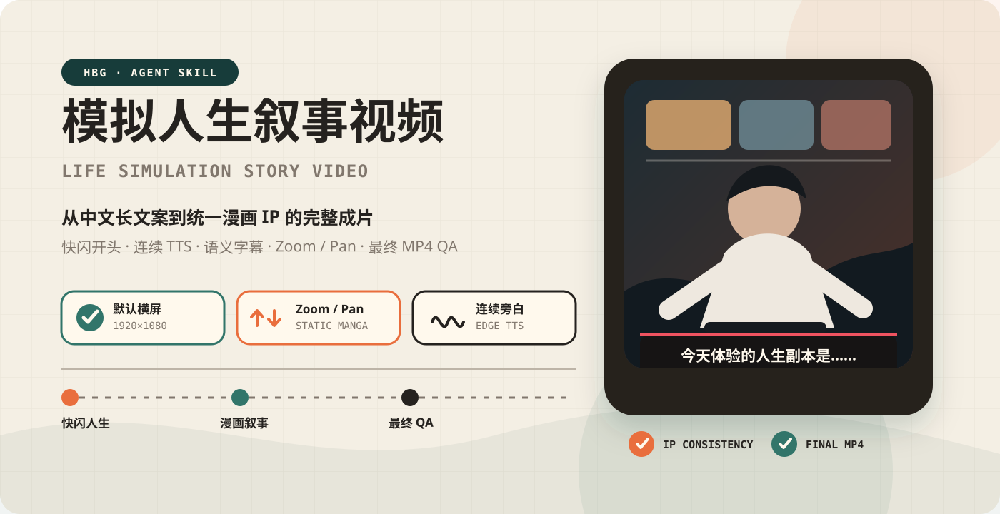
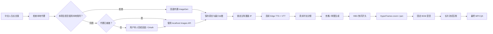

<p align="center">
  
</p>

<p align="center">
  <a href="https://github.com/URS1023/hbg_life_web/actions/workflows/ci.yml"></a>
  
  
  
  
  
  
  
</p>

<p align="center">
  把中文“模拟人生 / 人生副本”长文案制作成<strong>统一漫画 IP 的完整旁白视频</strong>。<br />
  <strong>快闪人生开头 · 连续自然语速 · 语义字幕 · 静态漫画推拉 · 稳定 BGM · 最终成片质检</strong>
</p>

## 网站开发文档

当前项目根目录为 `ai_life_apply/`。网站前端位于 `apps/web/`，后端位于 `backend/`；目前为演示骨架。根目录已有制作脚本与规范将用于后续完整生成服务，实际完成状态见开发状态文档。

- [产品规划](docs/web-product-plan.md) · [详细技术方案](docs/technical-design.md)
- [数据模型](docs/data-model.md) · [API 契约](docs/api-contract.md) · [工作流与恢复](docs/workflow-design.md)
- [AI 开发工作包](docs/implementation-backlog.md) · [验收标准](docs/acceptance.md) · [开发状态](docs/development-status.md)
- [本地演示运行](docs/run-local.md) · [架构决策](docs/adr/README.md)

以下保留制作 Skill 的使用说明；其中桌面账户代理和内置工具不是已接入的网站生产渠道。

<a id="agent-install"></a>

## ⚡ 一句话安装进 Agent

把下面整段话直接发给 Codex、Claude Code，或其他支持 `SKILL.md` 的 Agent：

```text
请从 https://github.com/URS1023/hbg_life_web 安装
hbg-life-simulation skill。

请自动识别当前 Agent 的全局 skills 目录；如果已经存在旧版本，请先备份再更新。
安装后检查 SKILL.md、agents、assets、references 和 scripts 是否完整，
并校验所有 Shell、JavaScript 和 JSON 文件。

不要读取、打印、复制或上传任何本地 API Key、会话日志、用户文案、
生成图片、音频、视频、BGM 或项目素材。

验证完成后，告诉我如何使用 $hbg-life-simulation
把一段中文人生故事制作成统一漫画 IP 的横屏旁白视频。
```


安装完成后可以直接说：

```text
使用 $hbg-life-simulation 处理下面的人生故事。
默认横屏，先保存原文并锁定主角 IP，再生成连续 Edge TTS、同步短字幕和密集漫画分镜，
使用 HBG 快闪开头、交替 zoom/pan、恒定 BGM，最后输出并检查完整 MP4。
```

Skill 会先做一次不读取凭据内容的本地代理就绪检查，然后针对每个新视频项目询问是否使用用户自己的账号生图。即使代理已经就绪，也不能把“调用 Skill”当成账户额度使用或 OAuth 同意。用户同意后，登录仍由用户本人在浏览器或设备码页面完成；用户拒绝或账户没有图片权限时，才回退到内置 ImageGen。

| 统一 IP | 连续旁白 | 语义分镜 | 最终质检 |
|:---:|:---:|:---:|:---:|
| 锚点人物 + 固定特征 | 一篇正文一条音轨 | 4–8 秒静态漫画镜头 | 检查编码后的 MP4 |

## 🎯 它解决的不是“做一个幻灯片”，而是“交付完整故事”

| 常见问题 | Skill 的处理方式 |
|---|---|
| 开头只有职业名，没有完整人生标题 | 固定 lead → 快闪/齿轮 → 选中人生 → 完整标题顺序 |
| 快闪没有速度感 | 每一帧交替强 zoom-in / zoom-out，并检查编码后运动差值 |
| 主角每张图换脸 | 先生成身份锚点，再在每个提示词重复不可变面部特征 |
| 手机拿反、手指融合、工具不合现实 | 手机、手部和工具镜头使用单图，并进行全分辨率现实检查 |
| 一张图停留几十秒 | 根据真实 TTS 时长规划密度，普通镜头控制在 4–8 秒 |
| 字幕留下两三个字断尾 | 使用中文语义分词、标点边界和短尾审计 |
| 画面比语音晚几秒 | 所有分镜从 Edge TTS 的真实 VTT 时间轴对齐 |
| BGM 忽大忽小或完全听不见 | 默认固定音量，不做逐句 ducking，用开头预览校准 |
| 竖屏参数污染横屏项目 | 默认锁定 1920×1080，只有明确要求才启用 1080×1920 |
| 浏览器预览正常，成品出现黑帧或字幕越界 | 对最终编码 MP4 再做黑帧、静音、响度和关键帧检查 |

> [!IMPORTANT]
> 自动检查通过不等于视频完成。只有人物锚点、宫格拆图、高风险手部/手机镜头、开头运动、字幕安全区和最终编码 MP4 都经过检查，才允许交付。

## ✨ 核心能力

| 模块 | 能力 |
|---|---|
| 文案整理 | 原文归档、最小转写修正、动态章节切分 |
| 主角 IP | 固定年龄、脸型、发型、识别点、服装与阶段变化 |
| HBG 开头 | 多人生快闪、齿轮/棘轮音效、完整选中人生标题 |
| TTS | 正文一条连续 Edge TTS，默认 `+0%` 自然语速 |
| 字幕 | 真实 VTT 时间、语义短句、无句尾标点、横竖屏独立安全区 |
| 分镜 | 真实音频驱动密度，静态漫画单图与 2×2 宫格混合 |
| 生图 | 默认优先使用用户自己的 localhost CLIProxyAPI；拒绝或不可用时回退内置 ImageGen |
| 本地账户 API | 每个项目先确认；安装、启动、修复或 OAuth 前再次明确说明，用户本人完成登录 |
| 镜头运动 | 交替 zoom-in、zoom-out、pan-left、pan-right 与情绪 hold |
| 音频 | 连续旁白、快闪 SFX、固定增益 BGM 分轨混合 |
| 渲染 | HyperFrames 组合；长片支持低磁盘流式 FFmpeg 压制 |
| QA | 字幕、密度、样式、黑帧、静音、响度、手部、手机与最终帧检查 |

## 🚀 快速开始

### 方法一：让 Agent 自动安装（推荐）

复制 README 首屏的[自然语言安装提示](#agent-install)发给 Agent。

### 方法二：安装到 Codex

```bash
curl -fsSL https://raw.githubusercontent.com/URS1023/hbg_life_web/main/install.sh | sh
```

默认安装到：

```text
${CODEX_HOME}/skills/hbg-life-simulation
```

未设置 `CODEX_HOME` 时使用 `~/.codex/skills/hbg-life-simulation`。

### 方法三：安装到 Claude Code

```bash
curl -fsSL https://raw.githubusercontent.com/URS1023/hbg_life_web/main/install.sh | sh -s -- --claude
```

### 方法四：明确同意后安装并初始化自己的本地账户 API

下面的命令会额外下载经过 SHA-256 校验的 [CLIProxyAPI](https://github.com/router-for-me/CLIProxyAPI) 官方发布包，使用 Codex OAuth 登录用户自己的账户，并把服务限制在 `127.0.0.1`：

```bash
curl -fsSL https://raw.githubusercontent.com/URS1023/hbg_life_web/main/install.sh | \
  sh -s -- --with-local-proxy --proxy-provider codex --accept-oauth-risk
```

无浏览器回调环境可以使用设备登录：

```bash
curl -fsSL https://raw.githubusercontent.com/URS1023/hbg_life_web/main/install.sh | \
  sh -s -- --with-local-proxy --proxy-provider codex-device \
  --proxy-no-browser --accept-oauth-risk
```

> [!WARNING]
> CLIProxyAPI 是 MIT 许可的第三方 OAuth 代理，不是模型提供商的官方 API 客户端。它不会绕过订阅权限、限额、速率限制或服务条款。只允许登录用户本人拥有或获授权管理的账户。

这组命令本身就是用户的明确操作与风险确认。Agent 不得自行替用户运行带 `--with-local-proxy`、`bootstrap`、`login` 或 `--accept-oauth-risk` 的命令；必须先在当前对话中询问并获得清晰同意。OAuth 页面和设备码页面只能由用户本人操作。

本地代理配置、客户端密钥和 OAuth 记录默认保存在项目目录之外，并使用受限文件权限。安装器不会修改 Codex 自身的连接配置；这个接口只供明确选择的兼容客户端和批处理脚本使用。

生命周期命令：

```bash
SKILL_DIR="${CODEX_HOME:-$HOME/.codex}/skills/hbg-life-simulation"

"$SKILL_DIR/scripts/setup_local_cliproxyapi.sh" status
"$SKILL_DIR/scripts/setup_local_cliproxyapi.sh" ready
"$SKILL_DIR/scripts/setup_local_cliproxyapi.sh" smoke-test
"$SKILL_DIR/scripts/setup_local_cliproxyapi.sh" stop
"$SKILL_DIR/scripts/setup_local_cliproxyapi.sh" start
```

完整安全说明见 [references/local-account-api.md](references/local-account-api.md)。

### 方法五：手动安装

```bash
git clone https://github.com/URS1023/hbg_life_web.git
mkdir -p ~/.codex/skills/hbg-life-simulation
cp SKILL.md ~/.codex/skills/hbg-life-simulation/
cp -R agents assets references scripts ~/.codex/skills/hbg-life-simulation/
```

## 🤖 使用示例

### 默认横屏人生故事

```text
使用 $hbg-life-simulation 处理下面的文案。
默认横屏，使用同一个漫画主角贯穿故事，语音不要加速，字幕跟声音同步。
```

每个新项目开始时，Skill 默认会询问是否使用你自己的 localhost 账号接口生图；回答“不”即可改用内置 ImageGen，不会启动安装或登录。

### 明确指定竖屏

```text
使用 $hbg-life-simulation 制作这篇人生故事。
这次明确使用 1080×1920 竖屏；字幕保持在竖屏安全区，不能照搬横屏参数。
```

### 使用兼容 Images API

```text
使用 $hbg-life-simulation，并使用我已配置在当前进程环境变量中的兼容 Images API。
先生成主角锚点，再以并发 5 批量生成宫格和高风险单图。
不得把 endpoint 或 API Key 写入项目、提示词、日志、README 或 Git 仓库。
```

### 明确同意使用自己账户的本地 Images API

```text
使用 $hbg-life-simulation，先按安全规则初始化 CLIProxyAPI，
只绑定到 127.0.0.1，并使用我自己的 Codex 账户完成 OAuth。
先通过 models 和单图测试，再以并发 5 生成项目素材；不要修改 Codex 自身连接配置，
不要输出或保存 OAuth 记录、client.env、config.yaml 和本地客户端密钥。
```

### 只修复已有项目

```text
使用 $hbg-life-simulation 检查这个已有项目。
重点排查字幕短尾、过长静态镜头、手机方向、手部结构、开头 zoom、BGM 和最终 MP4。
```

## 🧠 工作原理



关键原则：

1. **原文先冻结。** 只修正明确转写错误，不改剧情、视角、立场或结局。
2. **声音先落地。** 用真实 TTS/VTT 时间决定分镜，不在音频完成后平均分配画面。
3. **身份先锚定。** 角色锚点通过后才并发生成其他镜头。
4. **高风险画面单独生成。** 手机、手部、烟、筷子、键盘、焊接和工具接触不放进拥挤宫格。
5. **最终 MP4 才是交付对象。** 源图和 HTML 预览不能替代编码后检查。

## 🗂️ 每个视频项目的核心产物

```text
project/
├── SCRIPT_SOURCE.md              # 用户原文，保持不变
├── PROJECT_SPEC.json             # 标题、章节、纠错、音频与开头配置
├── SCRIPT.md                     # 旁白稿
├── CHARACTERS.md                 # 不可变角色身份规则
├── STORYBOARD_BASE.json          # 语义分镜
├── STORYBOARD.json               # 真实全局时间轴
├── PROMPTS.md                    # 生图调用与拒绝/重生记录
├── HBG_STYLE.json                # 横竖屏样式唯一来源
├── audio_meta.json               # 真实音频时长
├── assets/generated/             # 锚点、宫格和最终镜头
├── qa/                           # 源帧与编码后检查
└── renders/                      # 版本化 MP4
```

## 🧰 常用命令

```bash
# 初始化默认横屏样式
node /path/to/hbg-life-simulation/scripts/init_project_style.mjs PROJECT_DIR

# 只有明确要求竖屏时
node /path/to/hbg-life-simulation/scripts/init_project_style.mjs PROJECT_DIR --orientation portrait

# 从项目目录运行共享构建器
node /path/to/hbg-life-simulation/scripts/build_script.mjs
node /path/to/hbg-life-simulation/scripts/build_storyboard_base.mjs
node /path/to/hbg-life-simulation/scripts/build_narration.mjs
node /path/to/hbg-life-simulation/scripts/build_composition.mjs

# 密度和样式门禁
node /path/to/hbg-life-simulation/scripts/audit_storyboard_density.mjs STORYBOARD.json
node /path/to/hbg-life-simulation/scripts/validate_style_system.mjs PROJECT_DIR

# 长片流式压制与最终检查
node /path/to/hbg-life-simulation/scripts/render_streaming_ffmpeg.mjs PROJECT_DIR OUTPUT.mp4
/path/to/hbg-life-simulation/scripts/verify_final_video.sh OUTPUT.mp4 QA_DIR 0.5:opening 5.0:title 60:body 600:ending

# 只做非敏感就绪检查
/path/to/hbg-life-simulation/scripts/setup_local_cliproxyapi.sh ready

# 仅在当前对话明确同意后：初始化用户自己的 localhost Images API
/path/to/hbg-life-simulation/scripts/setup_local_cliproxyapi.sh bootstrap \
  --provider codex --accept-oauth-risk
```

## 🧪 真实流程验证

此 Skill 已在一条 10 分 49 秒的横屏中文长视频上完成完整集成验证：

| 指标 | 结果 |
|---|---:|
| 画布 | 1920×1080 |
| 帧率 | 30fps |
| 总帧数 | 19472 |
| 静态漫画分镜 | 144 |
| API 生图成功任务 | 46 |
| API 传输失败 | 0 |
| 视觉拒绝并重生 | 2 |
| 黑帧事件 | 0 |
| 异常静音事件 | 0 |
| 综合响度 | -22.8 LUFS |
| True Peak | -4.1 dBFS |

验证覆盖了快闪 zoom、连续 Edge TTS、同步字幕、固定 BGM、手腕与手机高风险镜头、长片流式压制和最终编码抽帧。

## 🧰 环境要求

| 依赖 | 用途 |
|---|---|
| Node.js 22+ | 共享构建脚本与 HyperFrames CLI |
| FFmpeg / FFprobe | 拆图、运动、混音、编码与媒体 QA |
| Python 3 + `edge-tts` | 连续中文旁白与 VTT |
| HyperFrames | HTML 时间线、检查、开头预览与渲染 |
| ImageGen 能力 | 漫画锚点、宫格和单图素材 |
| CLIProxyAPI（首选，需同意） | 把用户自己的 Codex 等账户暴露为仅本机可访问的兼容 Images API；失败时回退内置 ImageGen |
| `media-use` / visual QA skills | 音频与最终视觉检查，推荐安装 |

仓库不包含模型权重、API Key、生成图片、故事文案、声音、BGM 或成片。

## 🗂️ 仓库结构

```text
ai_life_apply/
├── apps/web/                     # Vue 网站演示骨架
├── backend/                      # FastAPI 演示 API 与 Worker
├── compose.yaml                  # 当前演示部署配置
├── SKILL.md                       # Agent 核心工作流
├── agents/openai.yaml             # Skill UI 元数据
├── assets/                        # 横屏 / 竖屏样式模板
├── references/                    # 开头、视觉、分镜、生图、渲染规则
├── scripts/                       # 构建、拆图、渲染与 QA 工具
├── docs/                         # 产品、技术、验收、开发状态与展示素材
├── .github/workflows/ci.yml       # Skill、脚本和模板校验
├── install.sh                     # Codex / Claude Code 安装器
└── LICENSE                        # MIT License
```

## 🔐 隐私与素材边界

- 外部提供商 API Key 只能通过当前进程环境变量注入，禁止写入代码、项目、JSONL、报告或 Git 历史；本地 loopback 客户端密钥只能保存在项目外的受限配置中。
- CLIProxyAPI 的 `config.yaml`、`client.env`、OAuth `auths/` 和日志必须位于项目与 Git 工作区之外；本地服务只绑定 `127.0.0.1`。
- Agent 可执行不泄露内容的 `ready` 状态检查，但每个新项目使用账户额度前都必须确认；安装、启动、修复、登录和 OAuth 前必须再次明确说明，不得从调用 Skill 推断用户同意。
- 用户必须亲自在浏览器或设备码页面完成登录；Agent 不读取账号页、Cookie、浏览器存储、OAuth 文件、`client.env` 或本地客户端密钥。
- 本地生成的客户端密钥只用于访问 loopback 代理，不是提供商 OAuth token；两者都禁止打印、上传或提交。
- 不得使用代理绕过账户权限、配额、速率限制或服务条款，也不得登录不属于用户或未经授权的账户。
- 禁止提交用户原始文案、会话日志、生成图片、音频、BGM、视频与 QA 帧。
- API 提示词记录只能保存提示词、模型、尺寸、成功/失败状态，不能保存凭据。
- 兼容 API 可能返回不同尺寸或扁平化输出路径，所有输出必须在本地 staging 后校验。
- 使用第三方音乐、字体、图片或语音服务时，发布者仍需确认许可和平台条款。
- Agent 执行 Git 推送、公开发布或删除操作前，仍需获得用户授权。

## 📄 关于仓库

这个仓库保存网站演示骨架、产品与技术规划，以及可复用的 Agent Skill 和制作脚本。网站目标是让多个用户从关键词或脚本出发，逐步完成角色场景、旁白分镜、图片、音频和视频交付；当前功能范围以开发状态为准。原制作规范继续用于角色一致性、声音连续性、分镜密度和最终质量检查。
