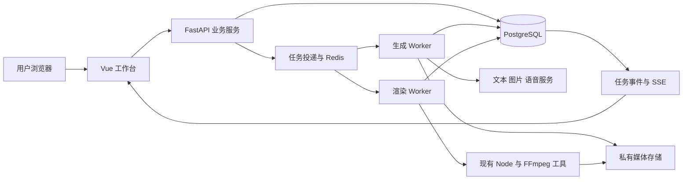

# 使用 AI 开发 HBG 视频网站：完整实施方案

日期：2026-09-19。性质：开发规划，尚未执行应用开发、安装、生成调用或部署。

## 1. 目标与执行方式

用户希望使用 AI 编码助手完成现有 hbg-life-simulation 的网站产品化，包括前端、后端、模型接入、多用户、任务管理、视频合成、测试和部署准备。

本文中的 AI 是开发执行者。产品运行时按已有产品规划提供分步骤创作；不因为使用 AI 开发而引入多 Agent 产品架构。

产品需求基线见 [web-product-plan.md](./web-product-plan.md)。网站保留关键词/脚本输入、规划、角色场景、提示词、旁白、图片、配乐、合成八步流程，支持逐步确认和局部重做。

执行原则：每次完成一个可运行功能切片，覆盖页面、接口、存储、后台处理和验收；以仓库内文档记录进度，使后续 AI 会话可以接着做。

用户负责提供产品偏好、实际可用的模型服务和最终效果判断；AI 负责分析、编码、迁移文件、测试、浏览器检查、问题修复和部署文件。涉及账号开通、付款、用户登录、外部资源权限时，不能用虚构配置代替实际条件。

## 2. 首版范围

首版交付一个可供多个独立用户使用的视频创作网站：

- 账户登录、个人项目和素材隔离、管理员管理用户及额度。
- 关键词创作与脚本输入，保留原文和编辑版本。
- 故事大纲、角色/场景卡、参考图与镜头提示词。
- 正文连续配音、字幕、基于真实音频的分镜时间。
- 单图和批量图片生成、失败重做、手动替换、历史候选。
- BGM/音效库或上传、音量设置、视频预览、MP4 与字幕导出。
- 持久化任务、进度、取消、局部恢复、用量记录。
- 横屏和竖屏模板，先验证短视频，再开放长视频。

公开收费、支付退款、团队协作、动态人物视频、口型同步和 AI 音乐生成列入后续里程碑，不以“未完成的占位按钮”冒充首版功能。

## 3. 建议技术方案

现有仓库没有应用框架约束，以下为建议默认方案，正式编码时锁定经过安装和运行验证的兼容版本。

| 层 | 建议选型 | 作用 |
| --- | --- | --- |
| 前端 | Vue 3、TypeScript、Vite、Vue Router、Pinia | 创作工作台、项目/素材/任务页面 |
| UI | Element Plus 基础控件 + 项目设计样式 | 表单、弹窗、表格、状态展示，视频工作台布局单独设计 |
| 后端 | Python FastAPI、Pydantic、SQLAlchemy、Alembic | 业务 API、权限、输入校验、数据迁移 |
| 数据库 | PostgreSQL | 用户、项目、版本、任务、资产引用和用量流水 |
| 队列 | Celery + Redis | 分离文本/图片/音频/渲染任务 |
| 任务真相来源 | PostgreSQL 中的任务和尝试记录 | 队列重投递、浏览器断线后仍能恢复状态 |
| 媒体存储 | 存储适配层；本地开发用私有目录，生产接对象存储 | 图片、声音、成片和临时下载 |
| 视频执行 | Linux Worker 中的 Node.js、Python、FFmpeg/FFprobe | 复用仓库脚本及其依赖 |
| 进度通知 | REST 状态接口 + SSE 事件 | 网页显示进度，断线后按事件游标恢复 |
| 测试 | pytest、Vitest、Playwright | 后端、前端关键状态、浏览器完整流程 |
| 部署 | Docker Compose 起步 + 反向代理 | 本地复现与初期单机部署；以后独立扩容 Worker |

Vue 使用 Composition API 和 `<script setup lang="ts">`，按功能拆组件；FastAPI 不在普通请求进程内执行长时间渲染。FastAPI 官方文档也将重计算场景指向 Celery 等独立任务工具。[官方说明](https://fastapi.tiangolo.com/tutorial/background-tasks/)

Celery 负责投递执行任务，但不是业务状态机。任务重复投递、供应商请求状态和额度结算需要应用自己处理；其官方文档要求为相关重投递策略考虑幂等性。[Celery 任务文档](https://docs.celeryq.dev/en/stable/userguide/tasks.html)

Windows 本机保留编辑与前端调试，后台任务及 Shell/FFmpeg 工具优先在本机 Linux 容器中执行。先核实 Docker 引擎确实在本机；远程 Docker context 中的数据库不视为本地测试库。



## 4. 仓库组织

建议直接在现有 hbg-life-simulation Git 仓库中增加网站应用，保留原有脚本和 Skill 资产，避免新建与上游无关联的嵌套 Git 仓库。

```text
hbg-life-simulation/
  apps/
    web/                       # Vue 网站
  backend/
    app/
      api/                     # 路由与认证
      models/                  # 数据模型
      schemas/                 # API 与生成结果结构
      services/                # 项目、版本、额度和任务逻辑
      providers/               # 文本/图片/语音/存储适配器
      tasks/                   # Celery 任务入口
      rendering/               # 对现有脚本的包装
    migrations/
    tests/
  scripts/                     # 已有制作脚本
  references/                  # 已有创作规范
  assets/                      # 已有横竖屏样式
  tests/e2e/                   # 浏览器场景
  deploy/                      # 容器、代理、启动与运维文档
  docs/
    web-product-plan.md
    ai-development-plan.md
    ai-build-brief.md
    api-contract.md            # M0 阶段创建
    data-model.md              # M0 阶段创建
    acceptance.md              # M0 阶段创建
    development-status.md      # 执行时维护
```

媒体与运行目录不进入版本库；开发和测试的静态夹具不包含真实用户数据。依赖锁文件、必要工具版本和迁移纳入版本控制。

## 5. 数据和接口约定

M0 阶段先确定最小数据结构，后续按阶段迁移。不能每次让 AI 从头重新猜字段。

核心实体：users、workspaces、projects、project_revisions、script_versions、characters、locations、shots、assets、jobs、job_attempts、job_events、exports、usage_ledger、outbox_events。参考图和提示词随版本记录，任务绑定不可变输入快照。

第一版每个用户对应私人 workspace；接口从认证上下文确定空间归属，不直接信任请求中传入的 user_id 或 workspace_id。所有素材下载也校验归属。

建议 API：

| 领域 | 主要接口 |
| --- | --- |
| 账户 | 登录、登出、当前用户、会话状态 |
| 项目 | 新建、列表、详情、保存草稿、创建版本、复制 |
| 脚本 | 保存原文、生成规划、生成/修改脚本、确认版本 |
| 角色场景 | 新建/更新设定、生成参考图、选用参考图 |
| 分镜 | 生成、编辑、拆分、关联旁白、生成提示词 |
| 生成任务 | 请求旁白、请求镜头图片、批量提交、失败重试 |
| 素材 | 上传、列表、选用、授权下载 |
| 导出 | 请求预览、请求成片、查询质检、下载成片 |
| 任务 | 查询、事件流、取消、核对不确定结果 |
| 管理 | 用户状态、额度调整、渠道状态、失败任务查询 |

长任务提交返回 HTTP 202 和 job_id；任务状态查询与事件流分开。接口采用稳定错误码和用户可理解的信息。

更新项目携带 revision/version 并做并发冲突检查；任务完成时核对输入版本，旧任务不能覆盖最新选用结果。开始生成携带业务幂等标识，重复请求返回同一操作。

## 6. 接入现有脚本的具体工作

| 现有内容 | 改造方式 | 验收 |
| --- | --- | --- |
| build_script.mjs | 保留原文整理，增加应用层脚本导出适配；把固定开场句变成模板约束 | 一般脚本与 HBG 模板都能处理，原文不被覆盖 |
| build_storyboard_base.mjs | 新增模型规划服务输出分镜，再交校验器检查 | 无需人工创建分镜 JSON 才能继续 |
| build_narration.mjs | 拆出 TTS 服务与音频时间对齐；将供应商输出转换为统一格式 | 实际声音、字幕、分镜时间一致 |
| CHARACTERS/PROMPTS 规则 | 将参考规范转成可版本化提示模板和结构化产物 | 每个镜头知道引用哪些角色/场景/参考图版本 |
| image-generation.md | 实现服务端图片适配器，收集任务状态和真实结果 | 单图、批量、失败恢复、选用历史均可用 |
| HBG_STYLE.json | 由模板和项目设置生成唯一渲染样式快照 | 横竖屏、字幕、预览和导出一致 |
| build_composition.mjs | 模板化开场；生成前校验输入资产 | 普通开场和 HBG 开场都完整可用 |
| render_streaming_ffmpeg.mjs | 用独立运行目录包装，结构化进度，超时/退出/取消可控 | 一个项目的并行导出不会覆盖文件，Worker 不阻塞业务 API |
| verify_final_video.sh | 保留检测方式，解析结果并明确检测工具失败状态 | 不把空报告或执行失败当作检查通过 |

先采用独立执行目录和完成产物复用；逐镜头渲染断点恢复按阶段补齐，不能把“发现文件存在”当作产物有效。缓存需要输入版本、文件校验及完整写入标记。

## 7. 模型接入和开发替身

定义四类适配器：TextProvider、ImageProvider、SpeechProvider、StorageProvider。图片和音频接口保留供应商请求 ID、计量、输出媒体及时间信息；错误区分明确失败与结果未知。

模型参数从服务端配置获得。LLM 生成结构化 JSON，并在服务端验证角色引用、镜头顺序、字幕跨度等业务约束；格式正确不代表内容正确。

提供 mock 与 real 两种显式环境模式：

- mock：固定脚本、固定参考图、小音频夹具和真实本地 FFmpeg 渲染，用于页面联调、恢复和权限测试；页面与运行记录标记模拟模式。
- real：实际连接指定模型渠道，保存可验证的请求 ID、费用和产物；至少完成一条真实短视频才能通过模型集成验收。

真实渠道未就绪时可继续与其无关的开发，但对应集成里程碑保持未完成。服务不可用时不能静默换为 mock 并显示“生成成功”。

开发运行前需有文本、图片、语音三个渠道的最小能力配置。用户提供配置位置或在管理入口配置，AI 不要求将密钥粘贴到提示词、文档或版本库。现有 Codex 会话工具和 localhost 代理不自动成为网站后端能力。

## 8. 任务恢复、成本与隔离

任务状态机：queued → running → succeeded / partially_succeeded / failed / reconciling；支持 cancel_requested → cancelled，另有等待用户输入状态。

- 创建 job、预算预留与 outbox 事件在同一事务提交；投递器只投递已提交事件，防止数据库有任务但队列无消息。
- Worker 获取租约并定期心跳；重启后的任务先核对已有产物/供应商状态，再决定是否重新执行。
- Celery 重投递可能重复执行，数据库唯一约束、业务幂等记录和供应商请求核对共同防重；不声称队列提供“恰好一次外部调用”。
- 外部服务明确暂态失败可做有上限退避；超时但可能已被接受的付费请求进入 reconciling，不盲目重发。
- 额度预留、消耗、释放分别记账；供应商后台成本和用户扣费分开。
- 取消后不再提交新调用；已提交请求与子进程按能力结束并结算。
- 每个运行有独立目录；路径由服务端构造，不允许用户输入或模型输出直接成为 shell 命令、文件系统路径或任意下载地址。
- 部分图片失败不删除成功图片；上游修改触发明确的下游过期标识。

开发测试另有硬边界：只连接经核实属于本机实际服务的数据库，包括核实 host、port、库名和容器/进程归属。数据库测试出现超时、断连或资源异常即停止并核查在途查询，不按普通外部 API 重试策略继续。

## 9. 交给 AI 执行的开发里程碑

每一行都是可单独验收的开发任务，不按估计工期自动跳过。

| 阶段 | AI 开发内容 | 可见交付 | 必须通过的验收 |
| --- | --- | --- | --- |
| M0 开发基线 | 页面清单、实体/状态、API 契约、环境检查、验收场景 | 数据模型、API 文档、阶段状态表 | 八步流程与后台状态对应；已有脚本复用边界明确 |
| M1 工程与账户 | 前后端骨架、本地依赖、迁移、登录、项目 CRUD、私人空间 | 可登录并创建项目的网站 | 两个账户互不可见；刷新后项目仍存在；构建/类型检查通过 |
| M2 最小视频闭环 | 任务记录、队列、存储、mock 素材、FFmpeg 渲染、事件和下载 | 从项目输入到真实可播放 MP4 | API 返回不等待渲染；关页后任务完成；非法下载被拒绝 |
| M3 脚本与规划 | 真实文本渠道、关键词/脚本入口、大纲、原文/编辑稿、版本 | 可以实际生成并保存脚本 | 结构化校验、原文保留、局部编辑、失败不覆盖原稿 |
| M4 角色场景与生图 | 角色场景编辑、真实图片渠道、锚点和历史候选 | 用户能生成并选择人物参考图 | 引用正确、选用可追踪、失败可修复、用量可核对 |
| M5 旁白与分镜 | 真实语音渠道、字幕对齐、分镜规划、提示词、镜头批量图片 | 用户可获得完整视听素材 | 旁白真实时长驱动时间轴；单图重做不重跑全部 |
| M6 工作台完整体验 | 八步导航、素材库、任务中心、配乐、预览、导出/质检 | 从关键词到成片的真实完整产品 | 一条真实短片走通；预览和 MP4 相符；横竖屏都检查 |
| M7 多用户与故障完善 | 用量后台、用户限额、公平队列、取消、租约恢复、结果核对 | 能够邀请多用户试用的版本 | 重复提交/回调不重复扣费；重启可恢复；数据隔离测试通过 |
| M8 部署交付 | 容器、生产配置样例、迁移步骤、备份恢复、日志与部署说明 | 可部署包和发布检查结果 | 本地部署演练通过；指定外部环境部署按当时授权执行 |

权限、版本与任务记录从 M1/M2 就进入结构，M7 是异常行为和容量策略完善，不能到最后才补用户隔离。

M3 的文本、M4 的图像、M5 的语音接入各自使用小样验证，并记录实际能力和限制。M6 以前就需要早期真实调用，避免所有依赖风险拖到项目末尾。

## 10. AI 每次开发的工作规则

1. 读取产品规划、本文、仓库 AGENTS.md 和 development-status.md；检查真实代码和 Git 状态。
2. 确定当前里程碑和最小完整功能，不重复重建已完成部分，不破坏用户现有改动。
3. 更新必要的数据/API 契约，再实现数据库、接口、后台任务与页面。
4. 执行适合该变更的检查；涉及界面行为时实际在浏览器中使用。
5. 出现缺陷先定位和修复，再继续依赖它的功能。
6. 将完成项、证据、未通过项与下一项写入状态文档；区分“代码已写”“模拟验证通过”“真实渠道验证通过”。
7. 交付一个具体可检查的结果，并继续已授权且无阻碍的开发，不因每完成一个页面就重复询问是否继续。

一个功能任务的说明至少包含：目标、涉及页面/API、数据变更、验收场景、外部依赖、影响范围和完成证据。

不要求使用多个编码 Agent。单个 AI 连续推进即可；只有用户明确要求并行时再拆独立模块，并先固定共享 API 和数据契约。

## 11. 测试和发布验收

最小检查层级：

- 静态检查：前端类型、构建；后端导入、配置和迁移检查。
- 业务测试：账户隔离、版本冲突、任务幂等、取消、预算/用量流水、分镜与字幕边界。
- 集成测试：队列投递、Worker 运行、媒体存储、FFmpeg 与生成适配器。
- 浏览器测试：登录、新建、八步编辑、刷新恢复、失败重做、成片下载。
- 真实小样：自建脚本和素材，实际调用模型生成一条短片，检查人物一致性、音画同步和编码后结果。
- 故障测试：模拟 Worker 中断、供应商失败、重复回调、旧任务迟到；数据库不做未授权的故障注入或远程测试。

首版交付完成的必要条件：能够从关键词和已有脚本两条入口走通；普通用户可独立完成，用户之间数据隔离；成功素材可复用；失败有明确恢复路径；费用可解释；交付 MP4 可播放且通过规定检查；部署和维护文档与实际操作一致。

## 12. 部署与交付物

初期可以单台 Linux 服务器部署代理、API、数据库、Redis 和少量 Worker；媒体优先使用私有对象存储。具体 CPU、内存、磁盘和 Worker 并发由短片实际渲染数据决定，不预先承诺支持人数。

部署文档包括：环境变量样例、密钥注入、数据库迁移、服务启动/健康检查、管理员初始化、媒体访问、日志位置、空间清理、备份恢复和版本回退。公网访问、真实付款、域名证书、远程资源创建需要实际环境信息与对应授权；本方案不表示这些已完成。

最终交付：源码、依赖锁文件、迁移、页面与接口文档、自动化检查、演示项目和真实样片证据、容器和部署说明、管理员使用说明、当前版本限制。

## 13. 开发所需输入与下一步

现在即可完成 M0，并在本地环境可用后开发 M1/M2。真实模型配置缺失时，先完成适配器和 mock 联调，持续推进独立工作；需要真实调用的验收保持待完成。

后续需要实际确定：文本/图片/语音渠道及配置方式、是否沿用建议技术栈、部署目标、开放注册还是邀请制。默认按建议技术栈、中文漫画旁白视频、邀请制和本地开发推进，不因可选偏好未答复而反复停止。

可直接交给 AI 的启动任务见 [ai-build-brief.md](./ai-build-brief.md)。该文件是供后续开发调用的任务说明，本轮仅保存方案，没有自动启动其中的开发或外部操作。
