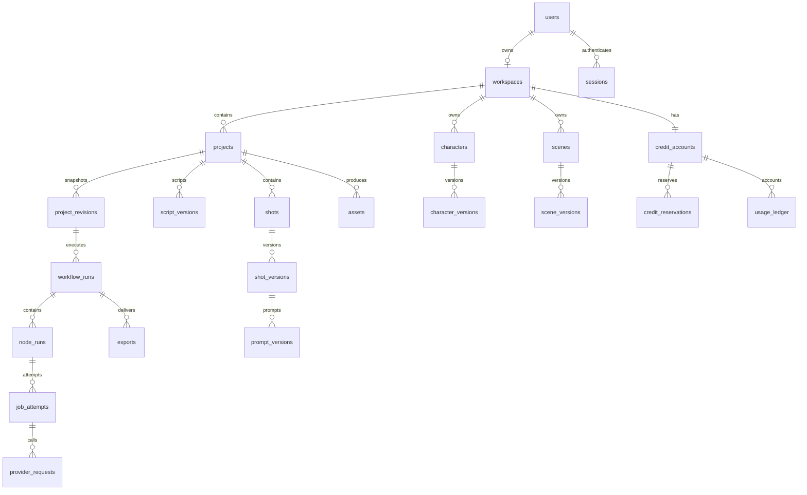

# 数据模型与迁移设计 v1

日期：2026-09-19。状态：规划；下列表结构尚未实现。架构入口见 [technical-design.md](./technical-design.md)。

## 1. 通用约定

- PostgreSQL 为正式开发/生产模型；SQLite 只保留现有演示数据，不作为锁、并发、迁移和额度验收替代品。
- 主键采用服务端 UUID；时间用 `timestamptz` 保存 UTC；API 用带时区 ISO 8601。媒体时间使用非负整数毫秒；最终画面边界使用整数帧。
- 所有空间数据有 `workspace_id NOT NULL`；父子复合外键同时引用空间和实体 ID，防止跨空间引用。项目内实体进一步使用 `(workspace_id, project_id, id)` 一致性约束。
- 可变聚合有 `lock_version bigint`，成功修改加一；不可变 version 表只插入，不原地更新正文、参数或来源。
- 表默认有 `created_at`；可变表另有 `updated_at`。下表省略部分通用列，不代表没有这些字段。
- ID、归属、状态、时间、选用引用、预算进入类型明确的列；JSONB 用于生成结构、供应商参数和快照 manifest，不把全部业务塞进一个 brief。
- 字符串枚举以数据库 CHECK + 应用 enum 约束，增值需迁移；金额/积分不用 float。文件不进数据库。
- 业务删除先归档/标记删除；快照引用的素材不能物理删除。具体保留期由运维配置，不凭浏览器删除动作立刻清空历史。

## 2. 实体关系概览

这是核心关系示意；assets 可以是空间级库素材，project_id 可空。完整约束以后文表设计为准。

## 3. 账户与权限表

| 表 | 关键字段 | 约束/说明 |
| --- | --- | --- |
| users | id、email_normalized、password_hash、display_name、status、is_platform_admin、created_at | email 唯一；账户状态 active/disabled；不保存明文密码 |
| workspaces | id、owner_user_id、name、status、created_at | P0 `owner_user_id UNIQUE`，一个用户一个私有空间；不预建团队角色体系 |
| sessions | id、user_id、token_hash、csrf_secret_hash、expires_at、last_seen_at、revoked_at | token_hash 唯一；会话可撤销；日志只写 session ID |
| invitations | id、token_hash、email_normalized、expires_at、used_at、created_by | 单次消费事务；token 不入审计正文 |
| password_reset_tokens | id、user_id、token_hash、expires_at、used_at | 仅单次有效；P0 管理员经身份确认生成重置入口，邮件投递另配渠道 |
| audit_events | id、actor_user_id、workspace_id 可空、action、target_type/id、request_id、metadata、created_at | 追加写；管理额度、改渠道、禁用账户等均记录；不复制用户原文和密钥 |

邀请兑换在一个事务中创建 user、workspace、credit_account 并标记邀请已用。业务权限来自会话和 workspace 归属；客户端声明的 workspace_id 不构成权限。

## 4. 项目、内容和不可变版本

| 表 | 关键字段 | 约束/行为 |
| --- | --- | --- |
| projects | id、workspace_id、title、input_mode、orientation、template_version_id、target_duration_ms、current_script_version_id、current_timeline_version_id、ui_step、status、lock_version、archived_at | title≤120；status 为 draft/archived/deleting；制作进度从节点推导，避免把项目状态混作任务状态 |
| source_documents | id、workspace_id、project_id、original_text、source_kind、digest、created_at | 原文不可变；再次导入创建新条目；50,000 字输入上限为初始配置，不等于 TTS 可处理长度 |
| plans | id、workspace_id、project_id、version_no、brief_json、outline_json、source_document_id、generation_attempt_id 可空 | UNIQUE(project_id,version_no)；大纲内容结构校验 |
| script_versions | id、workspace_id、project_id、version_no、parent_version_id、source_document_id、plan_id、text、chapters_json、normalization_map_json、content_digest、created_by | 已有脚本模式必须保留可追溯原文；章节含稳定 chapter_id；跨度按 code point 定义 |
| characters | id、workspace_id、origin_project_id 可空、name、current_version_id、archived_at、lock_version | 空间级身份，可在项目内引用；更新库中角色不自动替换项目引用 |
| character_versions | id、workspace_id、character_id、version_no、identity_json、appearance_states_json、reference_asset_ids、content_digest | 面部、发型、稳定特征与服装/年龄状态分离；参考图必须已 ready |
| scenes | id、workspace_id、origin_project_id 可空、name、current_version_id、archived_at、lock_version | 与 characters 相同归属模型 |
| scene_versions | id、workspace_id、scene_id、version_no、description_json、reference_asset_ids、content_digest | 地点、年代、布局、固定物体、时段和光线 |
| project_characters / project_scenes | workspace_id、project_id、entity_id、selected_version_id | 引用特定版本；复合外键验证空间；UNIQUE(project_id,entity_id) |
| shots | id、workspace_id、project_id、sort_order、current_version_id、selected_asset_id 可空、lock_version、archived_at | 稳定镜头 ID；拆分产生新 ID，旧 ID 归档；选图不改原始图片 |
| shot_versions | id、workspace_id、project_id、shot_id、version_no、script_version_id、text_spans_json、visual_description、character_refs_json、scene_version_id、motion_json、content_digest | 文本跨度、人物和场景引用由业务校验；所有 asset/ref ID 验证权限 |
| prompt_versions | id、workspace_id、project_id、shot_version_id、version_no、semantic_json、compiled_prompt、negative_prompt、provider_config_version_id、template_version_id、reference_asset_ids、parameters_json、content_digest | 保留实际发送提示词与参考图；与 shot_version 不可分离 |
| narration_versions | id、workspace_id、project_id、script_version_id、voice_config_json、audio_asset_id、alignment_asset_id、duration_ms、timing_source、content_digest | 音轨实际 ffprobe 时长；timing_source 区分 provider/aligned/manual/mock |
| caption_versions | id、workspace_id、project_id、narration_version_id、version_no、cues_json、text_mapping_json、content_digest | cue 含稳定 ID、start/end_ms、文本；不擅自声称修字幕等于改语音 |
| timeline_versions | id、workspace_id、project_id、version_no、narration_version_id、caption_version_id、fps_num/den、total_frames、manifest_json、content_digest | 镜头、混音、裁剪和字幕的完整清单；保存锁定素材引用 |
| project_revisions | id、workspace_id、project_id、revision_no、source_lock_version、manifest_json、input_digest、reason、created_by、created_at | UNIQUE(project_id,revision_no)；生成/确认/导出前建立不可变依赖快照 |
| revision_asset_refs | workspace_id、project_revision_id、asset_id、role | 将 JSON 内素材引用投影为关联表供 FK 和 GC 使用；与 revision 同事务写入 |
| confirmations | id、workspace_id、project_id、stage、project_revision_id、confirmed_by、confirmed_at | 确认脚本、角色/画风、生成预算等；修改输入后不复用旧确认 |

JSON 内人物/场景/镜头引用不能仅靠 JSON Schema 验证；应用在快照创建事务中验证归属、存在性及版本关系，并将涉及素材写入 revision_asset_refs。稳定 ID + 明确文本范围解决相同句子重复出现时 cue 匹配不唯一的问题。

创建快照流程：锁项目或 CAS 校验 lock_version → 读取当前被选版本和素材 → 校验依赖 → 写 revision/refs → 提交。事务结束后才可以调用外部服务。后台结果始终归属于输入快照，不直接覆盖 drafts。

所有影响项目生成输入的子实体编辑、选图和版本指针变更，必须在同一事务中取得项目锁并递增项目 lock_version；仅修改未被项目引用的库实体除外。由此项目快照与子内容读取一致，不能只锁 projects 行却允许另一事务绕过它修改 shots。可另保留子实体 lock_version 提供细粒度冲突信息。

## 5. 素材、存储和导出表

| 表 | 关键字段 | 约束/行为 |
| --- | --- | --- |
| assets | id、workspace_id、project_id 可空、kind、source、storage_backend、object_key、mime_type、byte_size、sha256、width/height、duration_ms、lifecycle_state、qa_state、producer_attempt_id、metadata_json、deleted_at | kind=image/audio/video/subtitle/manifest/qa；状态 staged/ready/rejected/deleting/deleted；QA 与 lifecycle 独立 |
| upload_sessions | id、workspace_id、project_id 可空、expected_kind、expected_size、staging_key、status、expires_at、asset_id 可空 | 上传完成前为隔离暂存；已完成请求重放返回相同 asset |
| shot_candidates | id、workspace_id、project_id、shot_id、shot_version_id、prompt_version_id 可空、asset_id、origin、created_at | origin=generated/uploaded；候选历史不因换选图删除 |
| dependency_edges | id、workspace_id、project_id、consumer_type/id、producer_type/id、producer_digest、role | 校验限定实体类型；用于影响分析；revision 是依赖事实，edges 是可重建投影 |
| artifact_freshness | workspace_id、project_id、artifact_type/id、checked_against_lock_version、state、reason_json | current/stale/unknown；是相对当前草稿的投影，不改不可变产物内容 |
| exports | id、workspace_id、project_id、project_revision_id、timeline_version_id、run_id、profile、status、output_asset_id、cover_asset_id、subtitle_asset_ids、qa_report_id、created_at | profile=preview/final；status=queued/rendering/checking/ready/failed/cancelled；ready 要求 QA 门禁通过 |
| qa_reports | id、workspace_id、project_id、export_id、tool_versions_json、checks_json、overall_status、created_at | 每项 pass/warn/fail/error/skipped；error 不等于 pass |
| media_access_events | id、workspace_id、actor_user_id、asset_id、access_kind、created_at | 记录签发或受控下载，不记录含签名的完整 URL |

对象 key 由服务端生成，例如 `private/{workspace}/{project-or-library}/{asset_id}/original.ext`；每次生成新 asset_id，原始文件不覆盖。缩略图、波形、转码文件单独记录 derived asset，并保留 source_asset_id。

同空间去重只用于文件复用且不能泄露另一用户是否已有某文件。相同 prompt 的新“重新生成”是新的候选请求，即使 seed 相同也不当作用户重复点击。

## 6. 执行和供应商记录

| 表 | 关键字段 | 约束/行为 |
| --- | --- | --- |
| workflow_runs | id、workspace_id、project_id、project_revision_id、workflow_version、kind、status、budget_limit_credits、estimated_credits、reservation_id、cancel_requested_at、created_by | 一次用户业务操作；kind 是有限允许列表；status 见工作流设计 |
| node_runs | id、workspace_id、project_id、run_id、node_key、item_key、input_snapshot_json、input_digest、status、not_before、progress、lease_owner、lease_expires_at、fence_token、error_code、created_at | UNIQUE(run_id,node_key,item_key)；单图是独立节点；fence_token 防失效 Worker 写回 |
| node_dependencies | workspace_id、run_id、node_id、depends_on_node_id | 同 run 无环；禁止跨项目依赖；跨 run 复用通过固定产物引用 |
| job_attempts | id、workspace_id、node_id、attempt_no、fence_token、status、started_at、finished_at、last_heartbeat_at、error_code、output_manifest_json | UNIQUE(node_id,attempt_no)；每次实际执行均保留记录 |
| provider_requests | id、workspace_id、attempt_id、provider_config_version_id、operation_key、external_request_id、request_digest、status、submitted_at、last_checked_at、usage_json、billable_state | 在发送前写 intent；external_request_id 可空；unknown 可人工核对；不保存密钥 |
| provider_callback_events | id、provider_config_version_id、external_event_id、payload_digest、received_at、processed_at | UNIQUE(provider_config_version_id,external_event_id)；验签后接受，内容脱敏 |
| job_events | workspace_id、seq、run_id、node_id 可空、type、payload_json、created_at | PRIMARY KEY(workspace_id,seq)；seq 由同空间游标行锁分配，保证提交可见顺序，不能直接用并发事务的 sequence 假设提交有序 |
| event_cursors | workspace_id、last_seq | 小事务末尾分配事件号后立即提交；进度事件限频，降低同空间竞争 |
| outbox_events | id、workspace_id、aggregate_id、event_type、payload_json、status、lease_expires_at、published_at、attempts | 创建任务/事件与业务事务一致；投递重复无害；另有过期 queued 扫描修复 broker 消息丢失 |
| idempotency_keys | workspace_id、actor_user_id、route_key、key、request_digest、resource_id、response_code、created_at、expires_at | UNIQUE(workspace_id,actor_user_id,route_key,key)；同 key 不同内容 409；活跃任务记录不提前清理 |

状态与 lease 更新使用单条条件 UPDATE 或短行锁事务。事务外执行生成/渲染；完成时以 node ID、fence_token、有效状态做 CAS。旧 Worker 结果可以进入孤立暂存/供应商核对，不能使当前节点或已取消任务回到成功。

## 7. 额度与成本模型

| 表 | 关键字段 | 约束/说明 |
| --- | --- | --- |
| credit_accounts | workspace_id、available_credits、reserved_credits、spent_credits、lock_version | bigint，三者非负；是 ledger 投影，不允许管理员直接手改 |
| credit_reservations | id、workspace_id、run_id、quoted_credits、reserved_remaining、consumed_credits、released_credits、status | 每 run 预留；分节点结算；unknown 部分继续保留 |
| usage_ledger | id、workspace_id、reservation_id 可空、node_id 可空、event_kind、available_delta、reserved_delta、spent_delta、operation_key、pricing_version_id、created_at | append-only；operation_key 唯一；reserve/consume/release/grant/revoke/refund 各有符号约束 |
| provider_costs | id、workspace_id、provider_request_id、external_charge_id 可空、metering_json、amount_decimal、currency、cost_state、updated_at | 平台实付成本；pending/estimated/confirmed/adjusted；与用户积分分离 |
| pricing_versions | id、effective_at、rules_json、created_by | 不可变价格规则；每项计量单位、上限和舍入规则 |
| quotes | id、workspace_id、project_id、project_revision_id、operation_kind、parameters_digest、pricing_version_id、line_items_json、total_credits、expires_at | 内容/价格/预算变更后旧报价不能启动新调用；任务绑定有效报价 |
| provider_configs / provider_config_versions | id、kind、display_name、enabled、current_version_id；version 中 model、endpoint、capabilities、secret_ref、timeouts | 管理权限；仅 secret_ref 入库；更换模型/能力创建新版本 |
| template_versions | id、key、version_no、schema_json、prompt_body、style_json、content_digest | 模板发布先验 schema 与小样；不修改历史版本 |

记账示例（积分为虚构演示单位，不是报价）：初始可用 100；预留 30 → available=70,reserved=30；消费 18 → reserved=12,spent=18；释放 12 → available=82,reserved=0。每次 reserve/consume/release 满足 `available_delta + reserved_delta + spent_delta = 0`；grant/revoke 改变总授予量。退款以 spent 减少和 available 增加记反向流水，不能删除原消费。

余额检查、预留、run、outbox、幂等资源映射在同一事务创建。consume 不超过该 reservation 剩余额；扣费幂等键针对 node/交付项，而非每次 Worker 尝试。实际成本超过用户授权预留时不得自动扣出负数，追加用户预算或由平台承担，策略按价格版本固定。

## 8. 最小索引和约束

| 查询/约束 | 索引建议 |
| --- | --- |
| 项目列表 | `(workspace_id, updated_at DESC, id DESC)`，排除归档视需求加 partial index |
| 项目内容版本 | `(workspace_id, project_id, version_no DESC)`；每实体 version_no 唯一 |
| 素材库 | `(workspace_id, kind, created_at DESC, id DESC)`；object_key 唯一 |
| 候选查找 | `(workspace_id, shot_id, created_at DESC)` |
| 待领取节点 | `(status, not_before, created_at, id)` partial on ready/queued/retry_wait |
| 租约扫描 | `(lease_expires_at)` partial on running/cancel_requested |
| 供应商结果核对 | `(status, last_checked_at)` partial on submitted/unknown |
| 事件恢复 | `(workspace_id, seq)`；按创建时间清理需辅助索引 |
| outbox 扫描 | `(status, created_at)` |
| 用量账单 | `(workspace_id, created_at DESC, id DESC)`；operation_key 唯一 |

JSONB 索引只在出现明确查询与执行计划证据后添加，不预建所有 GIN 索引。常用项目列表不读取大正文/manifest；大表分页，默认 20、最大 100。

## 9. 演示数据库迁移

1. 新建本机专用 PostgreSQL 开发/验收库，并核实实际服务归属；只准备 Alembic 迁移文件不等于已执行迁移。
2. 先建账户/空间/项目，再建版本/资产，再建工作流/额度，逐层通过结构与约束测试。
3. 如需保留演示数据，通过只读导出 SQLite 的项目和文本后导入新 workspace；禁止将任意 `Bearer user_id` 升级成有效会话或导入为管理员。
4. 旧 brief 中章节、人物、分镜映射为独立版本，旁白时长和图片数量仅保留 `demo_metadata`，不能创建 ready 媒体。
5. 旧 preview 标记演示导出；旧 queued/running 任务作为 legacy 记录终止导入，不自动向真实供应商续跑。
6. 以新配置显式切换 API；旧 SQLite 保留只读备份。迁移失败先停止切换，不自动改用另一远程数据源。

发布采用新增字段/表 → 兼容读取 → 切换写入 → 后续版本清理的扩展收缩路线。开发重置仅针对明确的本机临时库；生产回滚优先应用版本兼容，数据库破坏性 downgrade 不能当默认回退方式。
