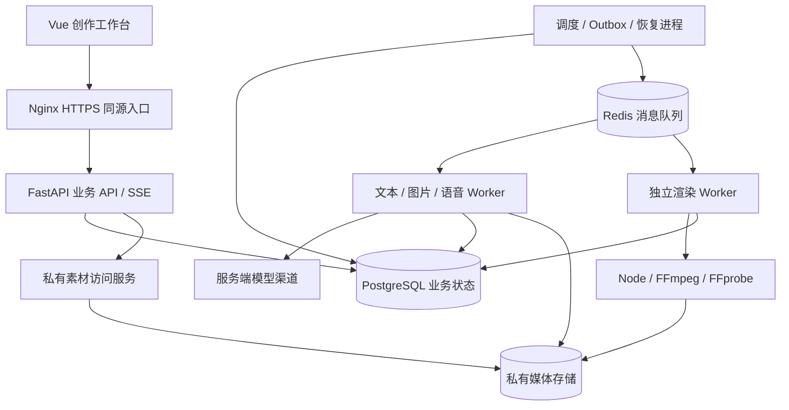

# 视频生成网站技术方案 v1

日期：2026-09-19。状态：待实施的技术基线；当前实现状态见 [development-status.md](./development-status.md)。

项目根目录为 `ai_life_apply/`。网站代码、部署配置和本文均位于该根目录。根目录下已有的 `scripts/`、`references/`、`assets/` 是可复用制作能力；嵌套的 `hbg-life-simulation/` 不作为网站开发、运行或提交目录。

## 1. 结论与交付范围

沿用 Vue 3 + TypeScript + FastAPI，建设模块化单体业务服务；采用 PostgreSQL 持久保存业务状态，Celery + Redis 投递任务，独立生成与渲染 Worker 执行长任务，私有存储保存媒体。生产流程以数据库中的固定依赖图和版本快照驱动。

AI 编码助手负责实现项目。产品内的模型负责写作、设定、分镜、提示词、图片和语音等有明确输入输出的生成工作。首版不需要引入自由运行的多 Agent 系统、向量数据库或专业多轨剪辑器。

P0 交付形态：关键词/脚本 → 可编辑规划 → 人物场景 → 连续旁白 → 分镜和提示词 → 图片候选 → 配乐混音 → 预览、MP4、字幕与封面。支持个人账户隔离、历史版本、单镜头重做、取消、重启恢复、管理员额度和模型渠道管理。

P0 默认中文单旁白、漫画静帧加镜头运动、16:9/9:16、30fps，目标 1–3 分钟，项目上限暂定 5 分钟。邀请制先上线；自助付费、团队协作、多角色配音、AI 音乐、图生视频作为后续能力。上述限制是设计默认值，不是已经验证的容量或用户新增的硬约束。

配套文档：

| 文档 | 内容 |
| --- | --- |
| [data-model.md](./data-model.md) | 表、字段、约束、索引、版本和迁移 |
| [api-contract.md](./api-contract.md) | 路由、请求响应、鉴权、幂等、SSE、上传下载 |
| [workflow-design.md](./workflow-design.md) | 节点依赖、任务状态、恢复、预算和取消 |
| [acceptance.md](./acceptance.md) | 场景、通过条件、本地测试边界与发布门槛 |
| [implementation-backlog.md](./implementation-backlog.md) | AI 可执行任务、依赖、交付和完成证据 |
| [adr/README.md](./adr/README.md) | 主要架构选择和取舍 |

## 2. 当前代码基线与缺口

本次基于根目录代码静态核对，基线提交 `e74e0d2`。表中的结论不表示本次重新执行了集成测试。

| 领域 | 已有代码 | 距离目标的缺口 |
| --- | --- | --- |
| 前端 | `apps/web/src/App.vue`、步骤组件、项目 composable | 无正式登录/路由体验；旁白、图片、音频、导出仍使用 `ComingStep`；持续全列表轮询 |
| API | `backend/app/main.py`，项目/任务 CRUD | `Bearer` 内容被当成用户 ID，缺省进入演示用户；必须替换认证；权限领域仍很薄 |
| 数据 | SQLite 的 users/projects/jobs | 无空间、不可变版本、资产、尝试、预算、审计和迁移；`brief_json` 混合多类产物 |
| 规划 | `providers.py` 可选兼容文本 API | 只生成一句话和固定四章；正文仍被写成固定演示稿，尚不是完整写稿功能 |
| 素材 | 固定四镜头和旁白/图片数量元数据 | 无真实语音文件、参考图输入、镜头图片候选和字幕对齐 |
| Worker | SQLite 排队和条件领取 | 可保存 queued 任务；running 任务无租约恢复；进程内取消不能保证停止线程中的外部调用或 FFmpeg |
| 合成 | FFmpeg 输出 4 秒无音轨标题卡 | 没有复用正式素材时间轴；同一项目共享 `preview.mp4`，并行导出会覆盖 |
| 部署 | Compose API/worker/web，Dockerfile | 仍用 SQLite；前端默认请求浏览器本机 8000；需统一同源代理；渲染镜像未包含完整 Node/脚本/中文字库 |
| CI | 原制作脚本语法和模板检查 | 未覆盖 Web 构建、后端业务、数据库迁移、浏览器流程 |

优先解决数据身份与版本，再接持久任务，然后替换演示生成与合成。页面存在或 FFmpeg 返回零退出码都不足以宣布完整闭环。

## 3. 系统拓扑与技术选择



| 层 | 决策 | 实现约束 |
| --- | --- | --- |
| Web | Vue 3、TypeScript、Vite、Router、Pinia | 保留现有技术栈；Composition API；服务端状态由 API 获取，Pinia 保存会话与编辑交互 |
| 控件 | 先复用现有样式与语义 HTML | 日期/表格/弹窗需要时引入控件库，不为一套组件重写页面 |
| API | FastAPI、Pydantic | `/api/v1`；生成 OpenAPI；业务操作调用 service，不将 SQL、模型调用、渲染放在一个路由文件 |
| 持久层 | PostgreSQL、SQLAlchemy 2、Alembic | 同步 Session 按请求/任务建立；外部 I/O 不持有事务；SSE 使用短查询，不长占数据库连接 |
| 任务 | Celery + Redis + 数据库调度 | Redis 不保存唯一业务结果；Celery task 只携带任务 ID；状态机由业务表维护 |
| 媒体 | StorageProvider | 本机开发使用私有目录；部署可切换私有对象存储；元数据和字节分离 |
| 渲染 | Linux Worker + Node + FFmpeg/FFprobe | 单任务工作目录；模板和渲染器版本固定；无 GPU 前置要求 |
| 通知 | SSE + REST 补查 | 一页一条空间事件流；断线补事件；必要时降级有限轮询 |
| 工程 | npm 锁文件、Python 锁文件、镜像 digest | 以安装/构建验证过的组合锁版；本规划不擅自升级当前依赖 |

首个兼容性验证环境以当前镜像中的 Python 3.12、Node 22 为起点，PostgreSQL 大版本及依赖精确版本在工程任务中锁定。涉及重计算的后台工作独立运行，符合 [FastAPI 后台任务文档](https://fastapi.tiangolo.com/tutorial/background-tasks/) 对大任务的适用边界。SQLAlchemy 会话按并发执行单元分离，依据 [Session 使用说明](https://docs.sqlalchemy.org/en/20/orm/session_basics.html)。

不在首版引入 Kubernetes、Kafka 或 Temporal。需要长时间跨系统审批、复杂补偿、多个团队维护流程时再评估工作流引擎；预留替换调度实现的边界，领域状态与素材版本继续保留。

## 4. 后端模块与目标目录

```text
ai_life_apply/
  apps/web/src/
    router/                   # 路由和登录守卫
    api/                      # 生成的类型、请求封装
    features/                 # auth/projects/scripts/characters/scenes/...
    components/               # 复用控件
    stores/                   # 会话、工作台编辑状态
  backend/
    app/
      main.py                 # 应用装配与生命周期
      core/                   # 配置、身份、错误、日志
      api/v1/                 # HTTP 和 SSE
      models/                 # SQLAlchemy 模型
      schemas/                # 请求、响应、生成产物契约
      services/               # 项目、素材、额度等领域逻辑
      repositories/           # 强制 workspace scope 的数据访问
      workflow/              # DAG、状态转换、失效计算、outbox、恢复
      tasks/                  # Celery 入口和运行上下文
      providers/              # text/image/speech/alignment/storage
      rendering/              # manifest、脚本适配、进程控制、QA
    migrations/
    tests/
  scripts/                    # 根目录已有制作工具
  references/                 # 创作规范；逐步转为版本化模板
  assets/                     # 样式和允许入库的固定素材
  tests/e2e/
  deploy/
  docs/
  compose.yaml
```

模块职责：Identity 识别用户；Project 管理草稿/快照；Creation 处理脚本、人物、场景、镜头；Asset 管理字节和候选；Workflow 编排执行；Usage 控制预算；Export 生成时间轴/成片；Admin 管理渠道与账户。模块共用一个数据库，通过 service 调用协作，不先拆网络微服务。

重构 `providers.py` 为同名目录前先迁移导入，避免模块/包重名并存。现有 `main.py` 的 import 时建库改为显式迁移及应用生命周期检查。

## 5. 八步工作台与后台产物

| 步骤 | 输入 | 持久产物 | 用户可操作 | 后台完成条件 |
| --- | --- | --- | --- | --- |
| 输入 | 关键词或原始脚本、时长、画幅、模板 | source_document、project draft | 原文保留/允许润色、导入 | 校验格式与上限；原文不可覆盖 |
| 规划 | 简报、原文和编辑要求 | plan、script_version | 编辑段落、章节、版本差异、确认 | 内容 schema 和语义引用校验；确认稿固定版本 |
| 人物场景 | 已确认脚本 | character/scene versions、参考图 assets | 编辑、生成候选、锁定身份 | 选用参考图真实存在且通过文件检查 |
| 旁白 | 正文、音色、语速、发音词典 | narration、alignment、caption version | 短试听、正式合成、字幕纠错 | 实际音轨可解码，时间信息匹配文本 |
| 分镜提示词 | 语义节拍、角色/场景版本、音频时序 | shot/prompt versions、timeline | 拆分、合并、换景、改提示词 | 台词覆盖、引用有效、时间单调、运动受限 |
| 图片 | 提示词、真实参考图、比例和模型配置 | 每镜头多个候选、选用记录 | 样张、批量、单镜头重做、上传 | 所有必需镜头有合格选用图；允许部分失败等待修复 |
| 音频预览 | 旁白、BGM、SFX、音量 | mix settings、预览导出 | 上传/选择音频、音量和淡入淡出 | 全片低清或选段预览通过结构检查 |
| 导出 | 不可变项目/时间轴快照 | export、MP4、SRT/VTT、封面、QA | 创建导出、查看问题位置、下载 | 成片生成和 QA 均完成，结果可追溯 |

步骤导航是 UI 状态，不能通过修改 `step` 绕过生成条件。服务端返回每步 `status / blockers / stale_reasons / allowed_actions`；用户可查看未就绪页面，但对应生成按钮由真实依赖控制。

## 6. 模型渠道与内容生成

### 6.1 固定的适配器协议

| 适配器 | 必需能力 | 不保证的能力 |
| --- | --- | --- |
| TextProvider | 生成结构化结果、模型/用量/请求标识、限时 | 不假设兼容接口都支持 JSON Schema、seed 或同一 token 参数 |
| ImageProvider | 提交图像请求、返回图片或外部任务标识、参考图和尺寸能力声明 | 不假设所有文生图接口能维持角色身份 |
| SpeechProvider | 音色目录、试听、正式音频、文本长度限制 | 不假设都返回字词边界，或均支持 SSML |
| AlignmentProvider | 文本与音频匹配，输出段落/字词时间与置信提示 | 不以均分字数冒充语音对齐 |
| StorageProvider | put/stat/open/delete、校验、受控下载 | 不把外部供应商 URL 当永久媒体存储 |

每个生成结果包含 `provider_config_version / model / provider_request_id / input_digest / usage / outputs / timing_source`。每个渠道声明 `supports_reference_images / max_reference_images / supports_idempotency / supports_status_query / supports_cancel / max_text_length / timing_unit` 等能力；只有声明并通过小样的功能才能启用。

服务端只接受管理员维护的模型渠道，普通请求传模型配置 ID，不传任意 API 地址。密钥只在服务端秘密配置中，通过引用读取；前端得到掩码和可用能力。桌面内置生成工具、本机账户代理不自动作为 Web 生产渠道。

### 6.2 文本、人物与提示词

关键词模式：简报 → 结构化大纲 → 章节正文 → 一致性检查 → 用户确认。已有脚本模式：保存原文 → 提取结构 → 按用户选择保留/润色 → 差异 → 确认。章数由内容确定，移除现在固定四章的限制。

生成模板分别维护规划、正文、角色、场景、语义分镜和镜头提示词，模板有版本、输入 schema、输出 schema、小样。模型不得产生可执行 shell、数据库操作或下载位置；生成结果只成为经校验的领域数据。

镜头提示词编译顺序：画风 → 角色身份及年龄/服装状态 → 场景固定特征 → 动作/景别/构图 → 光线/情绪 → 排除项 → 输出画幅。通用语义描述与供应商专用参数分开保存；切模型生成新的 prompt version，不修改历史结果。

身份一致性依赖锁定的参考图随请求实际传入。供应商不支持所需参考图时标记能力不满足，不悄悄只传角色名字。主角、次要角色、场景可以复用，但仅在同一私人空间内引用具体版本。

### 6.3 旁白与时序

正式正文优先一次生成连续音轨；先做 10–15 秒试听。实际模型有字符/时长上限时，首版限制输入在已验证范围；分章拼接必须另做听感、停顿及对齐验收后启用，不能无声切换策略。

音频时间先统一为整数毫秒，字幕文本位置统一为 Unicode code point 索引，并保留原文到规范化朗读文本的映射。各供应商偏移单位在适配器转换，例如 Azure 字词边界采用 100ns ticks；这说明需要转换而不是把返回值直接当秒。[Azure 字词边界文档](https://learn.microsoft.com/en-us/python/api/azure-cognitiveservices-speech/azure.cognitiveservices.speech.speechsynthesiswordboundaryeventargs?view=azure-python)

有可靠边界则直接规范化；只有音频则执行对齐节点。标点、数字读法、多音字通过发音词典和文本映射处理。低置信或覆盖缺失阻止“字幕已就绪”；允许人工修订。普通镜头默认参考 4–8 秒，最终边界由真实音频和语义共同决定。

## 7. 统一时间轴和合成

采用 `RenderManifest v1`，同一清单驱动预览和最终导出：

```json
{
  "schema_version": 1,
  "project_revision_id": "rev_example",
  "timeline_version_id": "timeline_example",
  "canvas": { "width": 1920, "height": 1080, "fps_num": 30, "fps_den": 1 },
  "template": { "key": "simple", "version": 1 },
  "shots": [
    { "shot_version_id": "shot_version_example", "asset_id": "image_example", "start_frame": 0, "end_frame": 180,
      "crop": { "cx": 0.5, "cy": 0.5, "scale": 1.0 }, "motion": { "type": "zoom_in", "strength": 0.04 } }
  ],
  "audio": [ { "asset_id": "audio_example", "start_ms": 0, "gain_db": 0 } ],
  "caption_version_id": "caption_example",
  "style_version_id": "style_example"
}
```

例子只展示结构，不代表完整可渲染项目；ID 在真实请求中采用 UUID。镜头区间左闭右开，时间轴边界统一换算为整数帧；累计边界取整后以最后一帧闭合，避免逐段四舍五入积累漂移。声音保留实际采样精度。

渲染前解析资产 ID，复制/下载到该次任务目录，验证 hash、尺寸、解码、时长、字体、磁盘预算。用户输入不直接成为文件路径、FFmpeg 表达式或命令行片段。允许的镜头运动与混音参数由 schema 限定。

首版导出为 H.264/AAC MP4、yuv420p、30fps、音频 48kHz，并使用 faststart；横屏 1920×1080、竖屏 1080×1920；低清预览按同一比例缩放为 720p 级别。参数为交付默认值，实际编码器和滤镜随镜像测试锁定。

字幕用同一布局算法及字体文件生成；输出 SRT/VTT，同时按设置烧录字幕。BGM 循环、旁白期间压低、淡入淡出和音效位置固定在混音清单中。FFmpeg 的混音、响度、字幕和黑场检测作为实现能力使用，依据 [FFmpeg 滤镜文档](https://ffmpeg.org/ffmpeg-filters.html)。

浏览器即时画面只标为编辑预览；用户确认的低清视频由服务端真实渲染，与最终 MP4 共用时间轴。两者只允许分辨率、码率和水印配置不同，不能一套 CSS 动画一套 FFmpeg 时序分别推算。

输出先写 `.partial`，完整解码和结构检查通过后再登记资产；QA 通过后才标记可交付。旧预览与旧导出按 revision 独立保存。Worker 终止时对子进程组先温和停止、到期强制结束，不能只取消 Python 协程。

## 8. 现有制作脚本接入路线

| 现有文件 | 具体改造 | 边界 |
| --- | --- | --- |
| `build_script.mjs` | 增加 generic/HBG 模板入口，原文和规范化稿分离 | 保留 HBG 约束；普通稿不强制补“人生副本”开头 |
| `build_storyboard_base.mjs` | 保留验证；上游 TextProvider 写结构化语义分镜 | 现有脚本不是自动分镜模型 |
| `build_narration.mjs` | 拆出音频输出协议、时间解析和字幕构建 | 生产供应商不锁定 Edge TTS；已有流程做兼容适配 |
| `project_config.mjs` | schema 版本、路径封闭、服务端资产引用适配 | `path.resolve` 后必须验证实际路径仍在任务根目录内，处理符号链接 |
| `build_composition.mjs` | 将固定 flash opening 抽成可选模板 | 无开场/无 BGM 也要合法，不再要求所有项目都提供开场视频 |
| `render_streaming_ffmpeg.mjs` | 接入 manifest、结构化进度、隔离输出、取消和超时 | 不通过复用同名工作目录实现恢复；成功片段用摘要校验后复用 |
| `verify_final_video.sh` | 每项保存工具退出码、检测结果、耗时和错误 | `grep` 无命中与 FFmpeg 失败分开，不用 `\|\| true` 吞掉故障 |
| `assets/hbg-style-*.json` | 迁移为版本化横竖屏模板快照 | 历史导出不随最新样式变化 |

先完成简洁模板的小片真实闭环，再接回 HBG 快闪模板。后台运行目录为 `<scratch>/<workspace>/<project>/<run>/<attempt>/`，其中均使用服务端 ID。已有脚本需要当前工作目录时，仅在该独立目录执行；不改变 API 进程全局 cwd。

## 9. 身份、权限和素材访问

邀请制注册 + 邮箱/密码登录 + 服务端不透明会话。密码使用 Argon2id；会话令牌仅存摘要，浏览器使用 HttpOnly/Secure/SameSite Cookie，登录轮换会话，退出和禁用账户可撤销。开发环境只在 loopback 放宽 Secure。写请求验证 CSRF token 与 Origin。[OWASP 密码存储](https://cheatsheetseries.owasp.org/cheatsheets/Password_Storage_Cheat_Sheet.html)、[OWASP 会话管理](https://cheatsheetseries.owasp.org/cheatsheets/Session_Management_Cheat_Sheet.html)

每个用户一个私人 workspace，P0 不开放团队成员。所有业务查询、批量操作、事件、上传完成、下载和任务重试均重新检查归属。ID 不是授权。数据库通过复合外键避免跨空间挂接资产；应用的 scoped repository 不允许无 workspace 的普通业务查询。RLS 作为下一阶段纵深防护，不能声称首版已启用；若启用须验证表 owner/BYPASSRLS 行为及连接池上下文清理。[PostgreSQL RLS 文档](https://www.postgresql.org/docs/current/ddl-rowsecurity.html)

管理员可管理账户、额度、渠道和任务元数据；默认不具备普通界面跨用户查看脚本/媒体的能力。确需支持排障时单独授权、记录访问原因和审计，不靠省略 where 条件实现管理端。

生产同源 `/api/v1`，不把 API 固定到访问者的 `127.0.0.1`。私有文件通过受鉴权代理或短时签名 URL；签名链接到期前具有持有者访问效力，不能宣传即时撤销，敏感操作使用代理。视频支持 HTTP Range，重新获取链接不改变素材身份。

上传校验大小、MIME 和实际解码，媒体处理有像素/时长/内存上限；禁止用户提供任意 URL 让服务端抓取。供应商回传 URL 按渠道允许域、解析结果、重定向和下载大小校验，防止访问内网。素材无公开静态目录。私有脚本/提示词不进入普通日志。

## 10. 前端工程和交互细节

路由：`/login`、`/projects`、`/projects/:id/:step`、`/assets`、`/tasks`、`/account/usage`、`/admin/*`。工作台拆分 script editor、character/scene cards、voice audition、shot table、candidate gallery、audio mixer、export panel；当前 `App.vue` 保留布局装配，业务状态进入 feature composables。

编辑草稿本地即时更新，约 800ms 防抖保存，并显示保存中/已保存/冲突/失败。提交生成前等待保存响应和版本号；切项目时取消过时读取，不让迟到请求覆盖当前项目。冲突时保留本地编辑并展示服务器新版本，不自动强行覆盖。

SSE 到达后仅更新受影响实体或触发对应查询，不每秒刷新全项目列表。页面离开关闭连接；事件以 ID 去重，断线 REST 补查后恢复；401 回登录，过期游标重新取快照。SSE 的事件 ID、断线重连机制依据 [MDN 文档](https://developer.mozilla.org/en-US/docs/Web/API/Server-sent_events/Using_server-sent_events)。

单张图和单条任务有独立状态；部分失败显示成功数和下一步修复操作。手机端支持查看、试听、选图、确认和下载，复杂分镜编辑桌面优先。表单有标签、键盘焦点、错误说明；进度不能只靠颜色；长列表按需分页/虚拟化。

## 11. 部署、运行和观测

本地建议 profile：web、api、scheduler、worker-text、worker-image、worker-audio、worker-render、postgres、redis。少量生成队列可以共用一个 Worker 进程配置；渲染单独限制 CPU、内存和并发。只有 Nginx 对外暴露，数据库/Redis 保持私网，开发端口仅绑定本机。

初次内测单机 Linux + Compose 足够作为部署起点；磁盘、CPU、内存按短片实测配置，不按规划承诺人数。api 镜像无需整套渲染依赖；render 镜像固定 Node、FFmpeg、字体和制作脚本。启动顺序：迁移 → 配置检查 → API/调度 → Worker → 网页；迁移只由一个发布任务执行。

配置分组：`DATABASE_URL`、`REDIS_URL`、`STORAGE_*`、`SESSION_*`、`MODEL_MODE`、`PROVIDER_*_SECRET_REF`、`WORKER_*`、`QUOTA_*`、`MEDIA_RETENTION_*`。示例配置只写变量名和假值。真实模式缺渠道时 readiness 标明缺项并阻止相关任务，不回退模拟成功。

健康接口：liveness 仅进程；readiness 检查 DB 连接、迁移版本和所需内部服务；Worker 能力注册检查工具/字体；不通过探活发起付费生成。外部渠道状态由最近调用和显式诊断维护。

结构化日志带 request_id、run_id、node_id、attempt_id、workspace_id；记录状态、耗时、错误码，避免原文/密钥。指标包括 API 延迟、排队时长、lease 过期、供应商成功率与 unknown 数、每分钟渲染耗时、磁盘、预算预留和结算差额。告警先覆盖任务停滞、待核对积压、磁盘不足和 ledger 不守恒。

数据库与媒体分别备份，保存引用清单；只恢复元数据而丢媒体不算恢复成功。初始运维目标建议 RPO 24h、RTO 4h，须经本机备份恢复演练测量后再对外承诺。默认暂存文件在终态 24h 后可清理；用户项目与选用资产不自动过期，孤立候选保留期在管理端配置，清理前排除快照/运行/导出的引用。

## 12. 容量与成本设计

业务并发和 Worker 并发分开：许多用户在线编辑不代表同时渲染许多视频。初始生产配置候选：每空间 2 个活跃生成子任务、1 个渲染；平台文本 2、图片 2、语音 1、渲染 1，后续按渠道配额和机器小样调整。数据库性能测试仍从单查询并发开始，与生产并发建议无关。

估算镜头数 `ceil(正文秒数 / 平均镜头秒数)`；180 秒、6 秒/镜头约 30 张，另加人物/场景参考图与重做。时间约由文案/确认、语音、图片批次、渲染组成，不能简单把所有节点耗时相加，也不能假设所有任务可并行。

图片阶段估计 `ceil(待生成张数 / 可用并发) × 单张观测耗时`，渲染使用 `视频秒数 × 实测渲染实时倍数`；待有人为确认时不继续给出虚假的完成倒计时。

用户额度和供应商成本独立：预估/预留/消耗/释放对用户解释，真实 token/图片/字符/秒/计算资源另记。渠道和价格规则版本固定到任务，任务运行中改价不追溯。真实单价尚未配置，本文不编造金额、月收入或容量。

## 13. 实施顺序与放行条件

按 [implementation-backlog.md](./implementation-backlog.md) 逐项推进，前置关系为：工程与同源入口 → 认证/空间 → 版本/资产 → 持久任务/额度 → 本地真实合成 → 文本/图片/语音渠道 → 完整工作台 → 多用户故障恢复 → 部署演练。

文本、图像、语音各渠道提前做小样，渠道能力未落实不会阻塞领域模型和 mock 开发，但真实验收保持未通过。用户需在真实集成前确定渠道、预算与密钥配置位置；部署前确定目标环境、域名和媒体存储。未提供这些条件时不伪造“全功能已完成”。

这次工作只形成技术方案及文档一致性修正；不连接数据库，不调用付费模型，不部署应用。后续所有数据库测试只允许核实属于本机的服务，连接前记录实际主机、端口、库名与进程/容器归属；异常即停止在途与后续测试，不自动换远程库或重试扩压。
