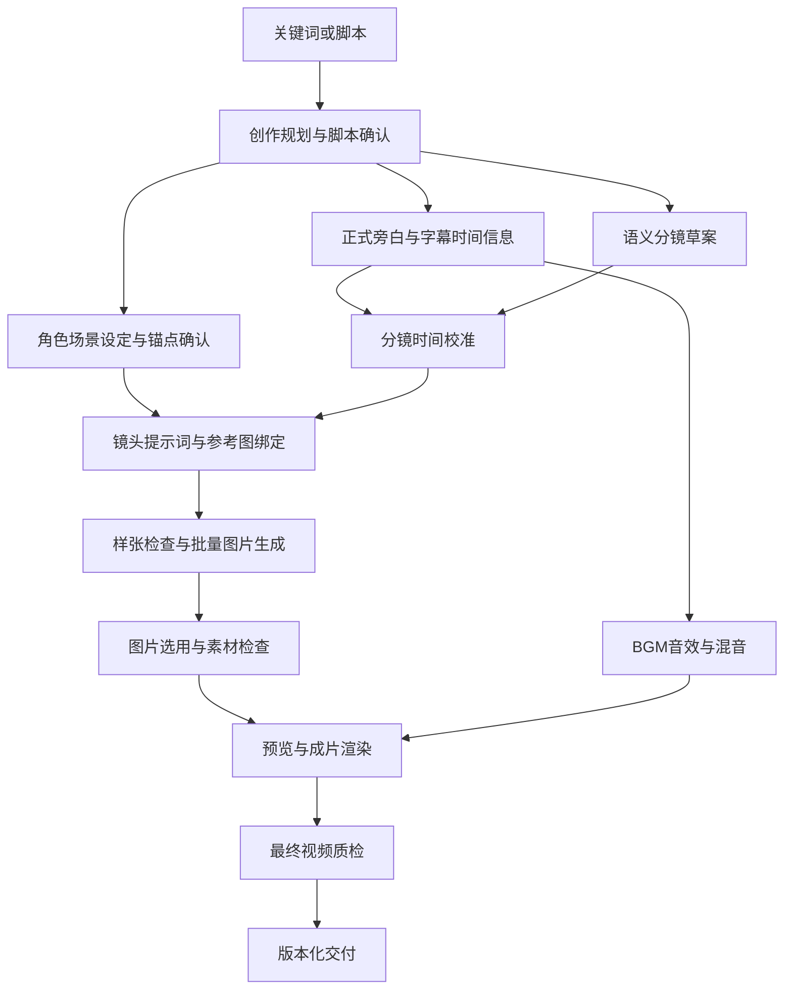

# HBG 视频创作网站产品规划 v0.1

日期：2026-09-19。状态：基于当前仓库的产品建议，供需求与页面设计使用；不是已完成的系统功能或交付工期承诺。

## 1. 产品定位与本轮假设

面向中文故事、人生模拟、职业体验类视频创作者，提供从关键词或脚本出发，逐步完成故事规划、角色场景设定、分镜提示词、配音配图、配乐与视频合成的在线创作工作台。

核心价值：让用户看得懂生成过程、能控制关键结果、能局部修改，并将可复用角色和素材沉淀到自己的项目中。

第一版采用当前项目已有的成片形态：漫画静帧 + 推拉平移镜头 + 连续旁白 + 字幕 + BGM/音效。动态人物表演、口型同步、图生视频属于后续独立能力，不能在首版宣传中混为一谈。

当前规划假设：

- 第一批用户为个人创作者，多用户独立使用；团队协作留作后续。
- 中文、单一旁白为主，可有多个画面角色。
- 优先验证 1–3 分钟内容；内测建议先将单项目上限设为 5 分钟，长片待质量、成本和任务恢复验证后开放。该限制是产品建议，不是现有脚本的能力上限。
- 支持 16:9 和 9:16，新建时明确选择；沿用当前横屏默认值。
- 一个主漫画风格，角色和场景可自定义；HBG 快闪开头作为可选模板，通用故事可使用简洁开场。
- 第一版以邀请制、平台统一配置模型、管理员发放额度启动；自助付费属于公开商业化阶段。

## 2. 当前项目盘点

当前目录是 Agent Skill 与本地辅助脚本，未发现 Web 前后端、用户系统、数据库模型、服务端任务队列或在线素材存储实现。本次仅阅读文件，没有调用生成服务、渲染视频或连接数据库。

| 能力 | 仓库证据 | 产品化判断 |
| --- | --- | --- |
| 故事整理 | scripts/build_script.mjs 读取已有原文、章节和纠错配置，并要求指定开场句 | 可复用整理规则；关键词创作、扩写与自由脚本适配需要新增 |
| 分镜规划 | scripts/build_storyboard_base.mjs 要求先存在语义分镜，再校验章节、cue 和运动 | 是分镜校验器；自动语义规划需要新增模型服务 |
| 角色与生图 | SKILL.md、references/visual-system.md、references/image-generation.md 定义锚点与提示词规则 | 规则可复用；当前仍依赖 Agent、外部工具与人工检查 |
| 旁白与字幕 | scripts/build_narration.mjs 调用 Edge TTS、解析 VTT、计算字幕和镜头时间 | 可复用算法；需拆分供应商适配、时间对齐与后台任务 |
| 样式和镜头 | assets/hbg-style-*.json、scripts/build_composition.mjs | 可作为模板与渲染输入，需加入模板版本与在线预览 |
| 合成 | scripts/render_streaming_ffmpeg.mjs、scripts/render_long_video.sh | 可封装为独立渲染任务；当前同步子进程不适合直接放在 HTTP 请求内 |
| 断点恢复 | 旁白有文件缓存；流式渲染遇到已存在工作目录会报错 | 不等于持久化任务恢复，需要执行记录、独立工作目录和产物校验 |
| 质检 | 密度、字幕、样式脚本及 verify_final_video.sh | 已有检测基础；最终视频脚本主要输出报告，部分检测使用 `|| true`，需补充执行失败识别和通过条件 |
| 多用户 | 当前以工作目录下的固定文件名串联产物 | 新增用户/空间归属、授权、独立运行目录与存储隔离 |

README 中记录了长视频验证案例，但本轮未复现；不将该案例直接当作网站并发能力、平均成本或成功率证据。

## 3. 用户目标与产品闭环

主要场景：

1. 用户只有关键词，例如“县城青年、外卖员、逆袭”，希望系统帮助完成故事与视频。
2. 用户已经写好脚本，希望保留原文，只生成角色、分镜、配音和成片。
3. 用户已经完成部分素材，希望上传图片、替换失败镜头并重新导出。
4. 用户重复制作同一主角系列，希望跨项目复用角色，维持视觉身份。

首版成功标准是：用户能在站内完成一个项目，并能只修复一个失败镜头后重新导出；刷新、关页或后台重启不丢失已确认的内容和已完成的产物。

## 4. 八步创作流程

### 第一步：创作输入

入口 A：关键词创作。输入主题、关键词、受众、语气、目标时长、横竖屏；高级项包括时代背景、叙述视角、结局方向和禁止出现的情节。

入口 B：已有脚本。粘贴或导入 TXT/Markdown；选择“保留原文”或“允许润色”。保留不可变原文，对改动提供差异预览，不自动改变剧情和结局。

入口 C：复制已有项目作为新项目。允许复制结构和已授权素材，成本与任务重新独立记录。

产物：创作简报和项目草稿。关键词路径生成多个标题/故事方向供选择；已有脚本路径直接进入结构分析。

### 第二步：故事规划与脚本

系统输出：标题、故事简介、开场、章节大纲、冲突与转折、结尾、完整旁白稿、预计时长、初步角色及场景清单。

交互：直接编辑、只重写选中段落、增删章节、调整语气和目标时长、查看版本差异。预计时长只是估算，后续以真实音频为准。

确认点：用户确认旁白稿版本；后续有成本的生成任务绑定该版本。

### 第三步：角色与场景设定

角色卡：姓名、剧情作用、年龄阶段、脸型、发型、辨识特征、服装及允许变化项。支持已有参考图和生成参考图，主角先选定身份锚点。

场景卡：地点、年代、时段、空间布局、固定道具、色调。先确认文字设定；反复出现的主要场景再生成参考图，单次场景可直接在镜头生成阶段制作，避免无效素材开销。

交互：修改描述、查看候选、设为选用版本、重做参考图、存入个人素材库。角色锚点生成前使用角色设定提示词；它与第五步的镜头提示词是不同产物。

确认点：用户锁定角色锚点与项目画风。提示词引用明确的角色版本与参考图，单纯重复角色名字不能作为一致性保障。

### 第四步：旁白与节奏

先选择音色、语速、情绪，试听一小段，再生成正式连续旁白。默认保持当前全正文连续音轨；开场可单独处理。

输出：正式旁白、真实总时长、带时间信息的字幕、章节时间点。字幕支持文本修正与安全区设置。

在前面步骤可以先预览分镜草案；最终镜头边界在此步骤之后，依据真实语音时序校准。如果所选语音服务不返回足够的时间信息，需要单独的音频文本对齐步骤，不能假设所有 TTS 都返回同样格式的 VTT。

字幕仅改错字且不影响发音时，可只更新字幕；改变实际朗读文本需要重新生成旁白并对齐。全篇连续旁白模式下，局部改稿通常意味着重做正文音轨，不承诺无损局部替换。

### 第五步：分镜与提示词

工作台以分镜表或卡片展示：镜头序号、对应旁白、起止时间、角色、场景、画面描述、构图景别、情绪、镜头运动、提示词及生成状态。

系统根据故事语义与实际音频规划分镜；普通镜头以现有 4–8 秒规则为起点，特殊停留可解释并调整。密度审计保留警告与阻断阈值，不将所有长镜头都当作错误。

提示词按“统一画风 + 角色身份 + 场景特征 + 当前动作与构图 + 排除项 + 输出比例”组合。默认用户编辑中文画面描述；高级面板展示和编辑模型提示词。

交互：增删或拆分镜头、调整分镜与旁白对应关系、单镜头重写、批量应用画风。首版采用受约束的分镜编辑，不开发专业多轨剪辑器。

确认点：显示预计图片数量、当前额度预估和预算上限，用户确认后开始批量生成。

### 第六步：图片生成与挑选

先生成少量代表性样张验证画风，再生成剩余镜头。参考图必须随模型能力正确传入；平台记录实际采用的参考图和提示词版本。

每个镜头支持生成、重新生成、上传替代图、查看历史候选、设为选用、预览横竖屏裁剪。系统只对待生成或显式选中的镜头发起任务。

首版默认一镜头一图，便于用户独立管理。当前 2×2 宫格能力可在后续作为成本优化；届时需要明确一次任务对应四张图，重做不能覆盖其他已选镜头。

失败按镜头显示原因与恢复动作。基础检测覆盖文件可读性、尺寸和比例；人物身份、肢体、道具等视觉问题给出辅助提示，并允许用户检查。人工接受视觉建议不能绕过系统级阻断。

### 第七步：配乐、音效与预览

旁白已在第四步生成；这里补齐 BGM、开场音效和镜头音效，并完成混音。

首版：内置可用配乐选择、上传自有音频、音量调整、循环与淡入淡出、内置音效。建议先沿用当前稳定 BGM 的混音方式。

如用户要求 AI 生成 BGM/音效，则作为独立供应商与成本项，排在后续版本；不要把“上传/选择配乐”标成“AI 音乐生成”。

提供短片段预览以及全片低清预览。最终导出和预览使用相同项目版本、时间轴、裁剪和字幕逻辑，避免浏览器预览正确但成片不同。

### 第八步：合成、质检与交付

展示素材检查结果、目标画幅、分辨率、预计渲染工作量。用户开始导出后可关闭网页，在项目或任务中心查看结果。

产物：MP4、字幕文件、封面、项目版本与质检摘要。素材包导出可在后续加入；首版保留站内单项素材下载。

状态包含等待渲染、正在渲染、正在检查、可下载、需要修复。渲染进程退出成功不等于通过质检。

结构性错误，例如缺失素材、不可解码、音视频时长异常，阻止交付；可能有创作意图的黑场、静音提供定位预览与解释，不简单一律判失败。

## 5. 页面与交互结构

| 页面 | 主要内容与操作 |
| --- | --- |
| 首页/项目中心 | 最近项目、封面、流程进度、待处理事项、新建/复制/归档 |
| 新建项目 | 关键词或脚本、时长、画幅、风格、创作模式 |
| 项目工作台 | 八步导航、当前内容、预览、版本、任务和成本提示 |
| 素材库 | 私有角色、场景、图片、音频，按项目和标签检索与复用 |
| 任务中心 | 排队、进行中、部分失败、等待确认、已完成、取消 |
| 账户与用量 | 账户设置、可用/预留额度、消耗记录；后续增加订单 |
| 管理后台 | 用户状态、额度调整、模板、模型渠道、失败任务与用量汇总 |

桌面工作台建议采用左侧步骤导航、中间编辑与分镜、右侧预览/属性，底部显示当前步骤操作与任务进度。手机端首版优先支持查看进度、预览、确认与下载，复杂分镜编辑以桌面为主。

步骤页显示“已生成”和“已确认”的区别。核心确认点为脚本、角色/画风、批量素材生成、最终导出，其余环节自动保存并可继续，避免每个后台操作都弹窗。

用户离开后回来，首先看到下一项需要处理的动作，例如“3 个镜头失败，其他 27 个已保存”，而不是只能看到一个总进度条。

## 6. 修改、依赖与版本规则

每个项目有可编辑草稿，每次生成绑定不可变的输入快照；产物记录脚本、角色、风格、提示词、声音和模型版本。正在运行的旧任务完成后保存为旧版本候选，不能覆盖用户后来修改的当前版本。

| 用户修改 | 默认影响范围 |
| --- | --- |
| 改项目名称 | 更新项目显示；若名称进入片头，则重做片头/导出 |
| 只改字幕错字，不改语音 | 更新字幕与导出，不重生图片和旁白 |
| 换单张镜头图 | 当前镜头选用素材、预览及导出 |
| 改镜头提示词 | 当前镜头生成结果标记待更新；原图保留 |
| 改一个角色锚点 | 引用该角色的镜头标记待更新，其他角色镜头保留 |
| 改一个场景设定 | 引用该场景的镜头标记待更新 |
| 改旁白文本、语速或音色 | 更新连续正文音轨、字幕和镜头时序；重新检查受影响分镜，语义仍适配的图片可保留 |
| 改 BGM/音效/音量 | 更新混音、预览与导出 |
| 改画幅或全局画风 | 重新检查构图、参考图和字幕；部分或全部图片需要重新生成 |

变更前展示影响预览，例如“将更新 8 张图片及成片，预计新增消耗……”。版本失效不立即删除产物，不自动触发整项目付费重跑。

## 7. 多用户、任务与额度

### 7.1 用户隔离

首版提供普通用户与平台管理员两种角色。数据模型预留 workspace_id：每个用户默认一个私人空间，未来再增加成员与团队角色。

所有项目、素材、任务、导出及下载均检查空间归属。分享链接如后续上线，应有独立可撤销权限；不能通过更换 URL 中的项目或素材 ID 获取他人内容。

生成工作目录按空间、项目、执行 ID 分离。服务端凭据不进入前端、提示词、项目导出包与普通日志。私有素材使用受控下载或短期有效地址。

### 7.2 后台任务

建议节点状态：未开始、待确认、已排队、进行中、部分成功、成功、失败、取消中、已取消、结果待核对；产物另有选用状态和是否因上游变更而过期。

“结果待核对”用于供应商超时但可能已经执行的请求：先查询或对账，避免无条件重发导致重复生成和重复成本。状态处理原则需要结合供应商能力实现。

刷新页面从后台恢复进度；取消后停止提交新任务，已经发出的请求按供应商能力取消或等待结算。后台持续运行不依赖浏览器连接。

按用户限制活跃任务数，同时设置平台及供应商总并发；文本、图片、语音、渲染分队列，重渲染不挤占所有生成任务。具体并发值在容量验证后配置，不承诺无依据的在线人数。

已成功的镜头不随其他镜头失败回滚。重试绑定相同业务操作标识并核对历史结果；新增候选属于新的用户操作。提交、回调与扣费都需防重复。

### 7.3 额度与费用

首版即记录预计、预留、实际消耗与释放额度，即使暂不接支付。管理员调整需有流水，任务消耗可追溯到用户、项目、阶段与产物。

展示口径以图片张数、旁白字数/时长、导出次数等用户可理解的单位为主；后台同时记录供应商实际调用成本。

单项目成本模型：文本规划 + 角色/场景参考图 + 镜头图片 + 旁白 + 配乐/音效 + 渲染资源 + 存储下载 + 重做成本。约 180 秒的正文按平均 6 秒一个镜头估算为约 30 个正文镜头，仅用于初始预算，开场与参考图另计。

生成前预估与预留；按明确的可交付规则结算，释放未使用预留。供应商实际成本和向用户扣除额度分开记账；平台失败是否免扣由产品定价政策决定，不能假设供应商失败一定不收费。设置项目预算上限，新增重做超限时暂停等待用户选择。

## 8. 后台执行顺序与复用路线

网站可以按八步展示，实际后台按依赖执行：

建议采用“Web 业务服务 + 持久化工作流/任务调度 + 生成 Worker + 渲染 Worker + 数据库存元数据 + 对象存储存媒体”的基础结构。首版业务服务可保持单体，独立部署长任务执行进程；无需一开始拆成大量微服务。

已有脚本作为渲染与处理工具逐步包装，优先将输入、输出、错误和进度结构化。文件产物如 PROJECT_SPEC.json、STORYBOARD.json 可作为 Worker 输入快照，在线系统的归属、版本和任务状态放在持久化元数据中。

需要新增或拆分的接口能力：文本规划、角色/场景设定、提示词构建、图像生成、语音合成、时间对齐、音频混合、渲染和质检结果解析。

当前强制 HBG 开场句、开场视频必需项和旁白构建器中的耦合需要改造为模板规则。保留 HBG 模板的质量要求，同时允许简洁开场模板。

模型渠道通过适配层接入。当前桌面内置 ImageGen 工具与用户 localhost 账号代理是 Agent 环境能力；普通网站不能直接假设拥有这些工具或访问访问者本机代理。首版使用平台管理的服务端生成渠道，自带 Key 或本地连接器以后单独设计。

语音接口需返回音频与可对齐时间信息。例如 Azure Speech 提供带音频时间偏移的字词边界事件，可作为候选能力；现有 edge-tts 是当前实现，不应未经线上验证就作为唯一生产依赖。[Microsoft 官方字词边界说明](https://learn.microsoft.com/en-us/python/api/azure-cognitiveservices-speech/azure.cognitiveservices.speech.speechsynthesiswordboundaryeventargs?view=azure-python)

长任务需要持久保存状态并在故障后恢复；Temporal 官方文档展示了此类持久执行能力，可在技术选型时评估。这里确定的是恢复需求，不提前指定必须引入该产品；无论采用何种调度方式，都需要供应商请求去重与费用对账。[Temporal 官方文档](https://docs.temporal.io/)

## 9. 核心业务对象

| 对象 | 关键内容 |
| --- | --- |
| 用户与空间 | 账户、归属、状态、权限 |
| 项目与版本 | 简报、画幅、模板版本、当前草稿、已确认快照 |
| 脚本版本 | 原文、编辑稿、章节、变更记录 |
| 角色与场景版本 | 描述、固定属性、参考图、项目/素材库归属 |
| 镜头与提示词版本 | 旁白引用、时间、角色/场景引用、运动、模型参数 |
| 媒体素材 | 类型、归属、存储位置、来源、尺寸/时长、生成来源与选用状态 |
| 工作流执行与节点任务 | 输入快照、依赖、状态、进度、尝试次数、取消信息、供应商请求标识 |
| 导出与质检 | 项目快照、输出规格、成片、检测摘要与问题位置 |
| 用量流水 | 预估、预留、实际消耗、释放、后台成本与用户额度 |

素材库复用应引用具体版本。用户更新库中角色，不自动修改已经完成的历史项目。

## 10. 版本范围与实施顺序

### P0：可内测的完整创作闭环

- 登录、私人空间、项目中心、八步工作台。
- 关键词生成脚本与已有脚本输入，脚本编辑和版本保存。
- 主角/配角、场景描述、参考图与统一风格。
- 单旁白、短试听、连续正式音轨、字幕与真实时间对齐。
- 可编辑分镜、自动提示词、单图及批量生成、失败镜头重做、上传替代素材。
- BGM/音效选择、混音、预览、MP4 与字幕导出。
- 后台任务恢复、取消、用户隔离、基础用量额度与管理后台。
- 最终视频自动检测摘要与用户确认；所有阶段错误可定位。

### P1：公开服务与效率提升

- 自助订单/支付、套餐与额度规则、存储保留策略及用户可见的清理提示。
- 更多经验证的画风与开场模板、系列角色库、批量创建项目。
- 更精细的局部修改、镜头复用、宫格生图优化。
- AI 配乐与音效、多音色或分角色配音。
- 分享链接、素材包导出、项目级通知设置。

### P2：扩展制作形态

- 图生视频或文生视频镜头，作为可选的更高成本镜头类型。
- 团队成员、审核权限、品牌模板、对外 API。
- 更丰富的时间线编辑、多语言和跨平台发布接入。

建议实施里程碑：

1. 做通一个短样片的无人值守后台执行，验证渠道、时间对齐和质量报告；此阶段产出真实成本/耗时数据。
2. 完成可编辑工作台，覆盖从新建到导出的每一页与局部重做。
3. 验证两个独立用户的隔离、并行任务、重启恢复、取消及额度流水，达到 P0 内测门槛。
4. 根据内测行为修正流程，再接公开付费、扩容与长片。

用户归属与任务 ID 从第一个里程碑就进入设计，不能等到第三步才补。未明确团队人数、既有技术栈、供应商与容量前，不给出固定周数或服务器成本承诺。

## 11. 验收场景与衡量指标

P0 必须验证的场景：

1. 输入关键词，从规划、角色、分镜、旁白到 MP4 交付完整走通。
2. 输入已有脚本并选择保留原文，不出现未经选择的剧情改写。
3. 一个镜头生成失败时，保留其他成功镜头，补齐后继续导出。
4. 换单张图不重生成旁白；改音色后重新对齐镜头，保留仍适配的图片。
5. 刷新、关闭浏览器再打开，以及 Worker 重启后，恢复正确状态；已经成功的外部生成不无条件重复调用。
6. 重复点击、重复回调与任务重试不会重复结算；不确定结果有核对状态。
7. 不同用户无法读取、修改或通过下载地址获得对方的项目与素材。
8. 取消后不再发出新的生成任务；已发出的请求和额度有明确最终状态。
9. 横竖屏的图片裁剪、字幕安全区和最终 MP4 与预览一致。
10. 黑场、异常静音、缺图和检测工具失败可区分；系统不会把“检查未执行成功”展示为“检查通过”。

核心指标：新建到首个成片的转化率、各步骤放弃率、用户实际操作时长、任务排队/生成/渲染耗时、单镜头可用率、重做比例、失败恢复成功率、每个可接受成片分钟的实际成本。内测先收集基线，再确定目标值。

后续数据库测试遵守本工作区约束：只使用经核实为本机实际服务的本地数据库；不因现有配置或“全量测试”字样连接局域网/远程库，不擅自改变在用工作流数据源。

## 12. 后续需求细化时需要确定的选择

本轮可按现有假设继续设计页面，以下选择会影响下一阶段的范围与成本：

- 首发是否只服务人生故事，或同时包含知识讲解、营销等内容。
- 目标视频时长与是否必须首版支持动态人物视频。
- 优先面向 PC 深度创作，还是手机端完成全部编辑。
- 模型供应商、部署地区与现有可复用的后端技术栈。
- 邀请制试用还是首日公开付费，以及预算/存储保留政策。

建议下一份交付是页面级 PRD 与工作台原型，先落实八步流程的操作、状态、输入输出和修改影响，再确定接口与开发任务。
