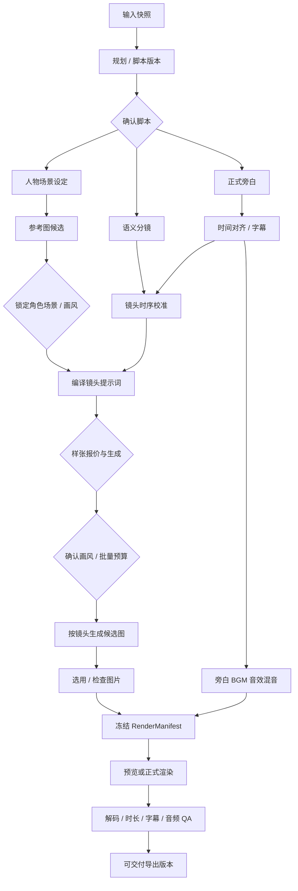

# 生成工作流、恢复与结算设计 v1

日期：2026-09-19。状态：规划。数据定义见 [data-model.md](./data-model.md)，接口见 [api-contract.md](./api-contract.md)。

## 1. 用户步骤和执行依赖

八步页面不直接等价于八个顺序脚本。用户确认是持久事件，浏览器关闭不影响后台已获授权的节点；未授权的付费阶段不能因上一步结束自动开始。

样张失败/拒绝停在候选选择阶段；不会自动继续全量花费。可在独立操作中同时进行参考图和旁白，两者分别计费、显示进度。

## 2. 节点契约

| node_key | 固定输入 | 输出 | 队列 | 完成门禁 |
| --- | --- | --- | --- | --- |
| plan.generate | source、brief、template version | plan/script candidate | text | schema、原文保护、章节有效 |
| entities.extract | script version | character/scene candidate versions | text | 引用与完整性检查 |
| reference.generate | entity version、style、provider config | image candidate | image | 可解码、比例、参考图实际传入 |
| narration.generate | script、voice、pronunciation map | audio + optional raw timing | audio | 实际音频文件及测量 |
| narration.align | audio、朗读文本映射 | alignment、caption version | audio | 覆盖与时间单调，低置信可修复 |
| storyboard.generate | script、entity refs | semantic shot versions | text | 正文覆盖、顺序、非重复 cue 误匹配 |
| storyboard.time | semantic shots、alignment | timing proposal | compute | 无意外空洞/重叠，帧数闭合 |
| prompts.compile | shot、style、references、provider capabilities | prompt versions | compute/text | 本地模板编译为主；需要模型改写才计为 text 调用 |
| shot_image.generate | 单镜头 prompt version | 单镜头候选 assets | image | 产物与请求关联；批量按镜头分节点 |
| audio.mix | narration、BGM/SFX、timeline | mix asset | render | 不截断旁白、音轨时长正确 |
| video.render | RenderManifest、profile | MP4 staged asset | render | 输出完整且可解码 |
| video.qa | staged MP4、expected manifest | qa_report、cover、subtitles | render | 阻断项全部通过 |

每个节点有输入/输出 schema_version、业务重试上限、供应商超时、租约、最大成本、可取消能力和产物验证器。节点定义由后端代码注册；模型输出不得新增任意节点或命令。

## 3. 三层状态机

**run 状态**：`waiting_confirmation / queued / running / partially_succeeded / reconciling / succeeded / failed / cancel_requested / cancelled`。partially_succeeded 是本轮执行结束但有失败子项，重新生成失败项创建关联的新 run；不把终态无限改回 running。

**node 状态**：`blocked → ready → queued → running → succeeded`；执行中可进入 `retry_wait / reconciling / failed / cancel_requested / cancelled`；依赖失败进入 `skipped`，有明确 skip reason。需要用户确认时不占用 Worker。

**provider_request 状态**：`prepared → submitted → pending → succeeded / failed / unknown / cancelled`。prepared 表示已保存请求意图，submitted 表示已进入可能产生外部副作用的发送区间；即使未收到 request_id 也不能认定未收费。

run 聚合优先级：存在结果未知先 reconciling；有取消意图先 cancel_requested；仍有工作则 running/queued；全部达到目标才 succeeded；混合成功失败为 partially_succeeded；无成功且不可恢复则 failed。视频 render 成功但 QA 失败，export 为 failed，不能显示 ready。

产物另有 `lifecycle_state / qa_state / freshness / selected` 四个维度。成功生成的旧版本图仍然成功，但相对新角色可能 stale；不能把成功任务回写为失败来表达过期。

## 4. 一次生成操作的事务边界

1. API 校验会话、归属、输入 revision、报价时效、模型能力、预算和幂等键。
2. 同一 DB 事务创建 run/初始 nodes、额度预留、outbox、审计及幂等映射；提交后返回 202。
3. 调度器按空间公平轮转，将符合依赖和并发配额的 ready 节点置 queued 并写 outbox；不一次把一个用户全部镜头塞满队列。
4. outbox 投递器发布 Celery 消息，消息仅含 node_id。发布成功后标记；发布后宕机可能重复发布，Worker 用 CAS 领取保证有效租约唯一。
5. Worker 短事务领取、增加 fence_token、写 attempt；事务提交后执行外部 I/O。heartbeat 更新自己的有效 lease。
6. 付费请求发送前落库 provider_request intent 和 operation_key。真正调用在事务外完成；同步/异步响应归一处理。
7. 输出写入隔离暂存，校验完成后短事务登记 asset/候选、CAS 更新 node、结算对应交付项、写事件和后继 outbox。
8. 草稿选用只在输入仍是当前版本且符合自动选用策略时以 CAS 更新；通常仅首个当前版本合格候选自动选用。旧结果保留为历史候选。

不得在持有账户或项目行锁期间调用模型、上传文件或渲染；避免长事务影响其他用户。

Celery 的确认/重投递行为要求业务任务具备幂等保护；`acks_late` 本身不提供外部副作用恰好一次保障。[Celery 任务文档](https://docs.celeryq.dev/en/stable/userguide/tasks.html)

## 5. 恢复与不确定结果

初始建议 lease 90 秒、heartbeat 每 15 秒，按任务类型调整。fence_token 单调增长，所有完成/心跳/取消写回均核对 token；旧 Worker 恢复后无法覆盖新尝试。外部请求和平台费用核对独立于该写回限制，避免丢失已花费事实。

| 故障点 | 恢复动作 | 禁止行为 |
| --- | --- | --- |
| 业务已提交但 Redis 未收到 | 重放 outbox | 丢掉已预留额度或让用户重新创建同一操作 |
| Redis 丢失已确认发布的消息 | 扫描长期 queued 且未领用节点，重新投递相同 node_id | 只靠 outbox published 标记认定永远已送达 |
| Worker 执行本地纯计算时退出 | 过期 lease 后新 attempt，按 manifest/hash 检查缓存 | 只因为文件存在就复用 |
| 供应商受理后 Worker 退出 | 按 external_request_id 或 idempotency key 查询 | 无条件重新发起付费生成 |
| 发送超时且无查询能力 | provider unknown、node/run reconciling；冻结对应剩余预留并通知 | 把 timeout 自动等同明确失败 |
| 媒体已落盘但 DB 未提交 | 检查 attempt staging manifest，校验后注册；无有效关联者等候 GC | 直接再调用供应商 |
| 旧版本任务迟到 | 记录历史候选和成本，不改当前选用 | 覆盖用户刚改好的脚本/图片 |
| 重复/乱序回调 | 验签、事件唯一键、供应商状态单调规则 | late pending 将 succeeded 退回运行中 |

自动重试只用于能够确定未受理的暂态错误或可安全幂等的查询/本地步骤，初始最多 3 次、指数退避加抖动。鉴权、额度不足、参数/内容拒绝不重试。连接错误是否“未发送”须依据客户端可证明状态，普通断连不能据此断定。

核对轮询初始 10/30/60 秒递增并封顶，设置总核对窗口和告警；供应商仍 pending/unknown 时转人工跟进但保持事实未知，不自动释放其全部预留或发新请求。确需新候选，用户通过独立报价重新提交，旧请求继续独立核对。

Celery Redis 的 visibility timeout 必须与已配置单次执行上限一致设计；过长/过短都有恢复代价。较长异步生成采用提交节点 + 定时查询，等待期间不占执行 Worker，不用很长的 ETA 消息堆在 broker。周期扫描和 lease 才是业务恢复依据。[Celery Redis 注意事项](https://docs.celeryq.dev/en/stable/getting-started/backends-and-brokers/redis.html)

数据库测试的超时/断连不适用上述业务重试策略：一旦发生即停止后续测试和检查在途查询，按工作区约束处理。

## 6. 取消协议

API 接收取消只写 cancel_requested 和事件。调度器停止派发新节点，队列消费者领取前再检查。已有任务在每次外部提交前也检查取消状态。

- 还没调用供应商的节点直接 cancelled，释放对应预留。
- 支持供应商取消则调用并核对最终结果；不支持时保留外部请求追踪，停止自动接续后继任务。
- 渲染任务结束整个子进程组，产物只作为暂存，不发布未完成文件。
- 与请求发送同时发生的取消可能已有请求在途，界面显示“取消中，正在核对已提交任务”；不能承诺零费用或瞬时停止。
- 外部终态、费用和可用素材全部核对后才将 run 终结 cancelled；历史消耗和已完成候选保留。

重试和取消使用 CAS，避免同一节点一边取消一边新开尝试。用户再次生成使用新的 run，并显式选择范围，不复活已取消 run。

## 7. 依赖失效与最小重做

| 修改 | 标记失效 | 可保留 |
| --- | --- | --- |
| 项目名称 | 用到标题的封面/片头/导出 | 旁白及普通镜头素材，除非名称进入正文 |
| 仅字幕错字 | caption render、preview/final | narration、图片 |
| 单镜头选图/裁剪 | 对应片段、preview/final | 其他镜头、语音、文本 |
| 单镜头 prompt | 该镜头新候选生成建议及导出影响提示 | 原候选和用户选用；生成不强制立即执行 |
| 某角色/场景版本 | 引用该版本的 prompt/图片适配性、导出 | 无依赖镜头 |
| 旁白文字/音色/速度 | 正文音频、字幕、镜头时间、混音、导出 | 语义仍成立且经确认的图片 |
| BGM/音效 | mix、preview/final | narration、图像、分镜语义 |
| 画幅/画风 | style、构图/参考图适配、字幕布局、导出 | 仍适配素材可以经用户确认复用 |

计算依据是快照引用和 dependency_edges，不能只有一个全项目 dirty 布尔值。返回修改影响清单及估算，再由用户发起所选重做；后台不因一次文字编辑自动启动整片付费生成。

缓存摘要包含 canonical input、上游 asset hash、模型/提示模板/代码/渲染器版本和输出 profile。幂等识别针对同一用户操作；“再生成一张”带新 operation key，不能被缓存误吞。

## 8. 预算和公平调度

报价绑定操作、输入 revision、节点范围、候选数、模型和价格规则。预留总额不得低于明确计价上限；没有可限定价格的渠道需设置用户硬预算及平台承损规则。

节点失败不能假设供应商免收费。用户扣除额度按可交付规则结算，provider_costs 单独记录真实调用成本。取消、部分失败和重新生成各有流水，不使用一个 `project.cost += amount` 字段。

调度器按 workspace 轮转，每轮发有限节点；检查 workspace/global/provider 三层并发和速率。预留额度不等于占满 Worker。渲染独立队列，避免一个长片阻塞所有文本/图片任务。

用户进度以完成镜头/总镜头、节点阶段、已产出素材表示；供应商没有进度时显示等待/执行中，不用固定 sleep 将进度假装推进到 100%。

## 9. 日志、事件与验收

记录 run、node、attempt、provider_request 四层标识；用户看友好错误，管理员可凭错误码/请求 ID 排障。事件由同事务持久化写入，SSE 只传状态和实体 ID，不传密钥或全文。

最小故障验收为：重复提交、重复投递、供应商未知、Worker 中断、取消竞态、旧任务迟到、部分图片失败、额度并发。通过标准和受限故障注入范围见 [acceptance.md](./acceptance.md)。
